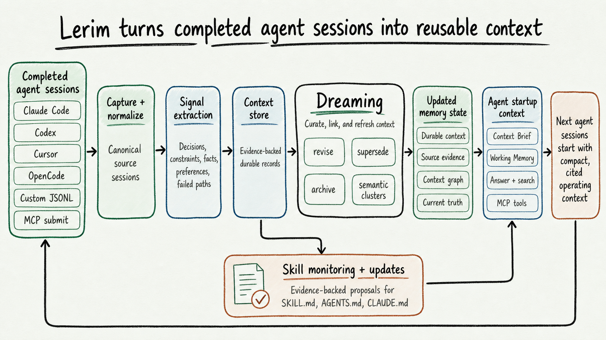

<p align="center">
  
</p>


<h1 align="center">Private improvement infrastructure for AI agents.</h1>

<p align="center">
  Lerim sits above agent traces, compiles useful signal into cited context and eval assets, and gives future agents the operating memory they need before work begins.
</p>

<p align="center">
  <a href="https://pypi.org/project/lerim/"></a>
  <a href="https://pypi.org/project/lerim/"></a>
  <a href="https://github.com/lerim-dev/lerim/blob/main/LICENSE"></a>
  <a href="https://github.com/lerim-dev/lerim/actions"></a>
  <a href="https://github.com/lerim-dev/lerim"></a>
</p>

<p align="center">
  <a href="https://lerim.dev/">Website</a>
  ·
  <a href="https://docs.lerim.dev">Docs</a>
  ·
  <a href="docs/benchmarks/index.md">Benchmarks</a>
  ·
  <a href="docs/examples/index.md">Examples</a>
  ·
  <a href="https://pypi.org/project/lerim/">PyPI</a>
  ·
  <a href="https://github.com/lerim-dev/lerim/blob/main/LICENSE">License</a>
</p>


<p align="center">
  
</p>

<p align="center">
  <em>Any trace-producing workflow can register clean JSONL and enter the same compiler path.</em>
</p>

<p align="center">
  
</p>

<p align="center">
  <em>Agents and humans ask through CLI, skill, or MCP; Lerim retrieves scoped, cited context.</em>
</p>

# Lerim

Lerim is a context compiler for repeated AI agent workflows.

Agents leave traces everywhere: terminals, tools, tickets, code reviews, support cases, research runs. Most of that history is too noisy to reuse directly.

Lerim filters those traces into evidence-backed context records and eval-ready workflow signal: the decisions, constraints, facts, preferences, corrections, and handoffs future agents should not have to rediscover.

Instead of replaying raw traces or losing useful context between workflows, Lerim keeps:

- decisions
- constraints
- preferences
- facts
- corrections
- handoffs
- evidence linked back to the source session

## What The Demo Shows

| Moment | Lerim does | Future agents get |
| --- | --- | --- |
| A completed agent run lands | Imports a source session from an adapter, MCP submit, or clean custom JSONL | A stable source boundary instead of a transcript paste |
| The trace is noisy | Compacts the run and filters for reusable decisions, constraints, facts, preferences, corrections, and handoffs | Durable context and eval-ready signal, not another log index |
| Someone asks later | Retrieves relevant records and answers with citations back to stored evidence | A shorter start with less re-explaining |

## Quick Install

```bash
pip install lerim
lerim init
lerim connect auto --mode auto
lerim project add .
lerim up
```

Native adapters let Lerim ingest completed local sessions where a stable trace
store exists. MCP setup writes Lerim tool entries for compatible agents; live
recall or trace-submit acceptance is claimed only where the integration matrix
lists installed-client/tool-call evidence:

```bash
lerim connect auto --mode mcp --dry-run
lerim connect auto --mode mcp
```

Then ask Lerim what a future agent should know:

```bash
lerim answer "What context should I know before working in this project?"
```

## Why Lerim

AI agents now triage tickets, investigate incidents, research markets, prepare handoffs, review policies, analyze customers, and change software.

Every run leaves a trace. Most traces are too long, too noisy, and too platform-specific for the next agent to reuse directly.

Without a durable context layer:

- decisions get re-debated
- constraints get rediscovered
- preferences get ignored
- every new session starts too close to zero
- useful corrections never become eval or training signal

Lerim fixes that by turning raw traces into reusable context records, eval assets, and training-ready workflow signal that remain queryable from agent tools and product workflows.

Lerim is meant for any trace-producing agent workflow. Today, native source
adapters are strongest for coding agents, and documented custom-trace paths cover
support and incident workflows. Coding is a proof-rich workflow pack, not the
whole product category:

- coding agents: repo conventions, architecture decisions, setup facts, failed paths, test lessons, release handoffs
- support operations: customer constraints, known fixes, failed fixes, escalation reasons, policy evidence, handoffs
- operations and incidents: root causes, mitigations, rejected hypotheses, runbook gaps, incident handoffs, follow-up risks
- research, compliance, security, revenue, and other custom business agents: source trails, assumptions, approvals, rejected paths, policy facts, and workflow-specific handoffs when the source owner handles export, cleaning, and redaction

## Key Capabilities

- Trace-to-context extraction. `ingest` reads supported sources and custom clean-trace folders, extracts reusable signal, and can archive routine runs without creating noisy durable records.
- Shared context across agents. What one agent learns can become useful context for a different agent or workflow later.
- MCP access for compatible agents. `lerim mcp` exposes context tools, and `lerim connect <agent> --mode mcp` writes client config with backups and verification.
- Context curation. Lerim consolidates overlap, archives weak records, and keeps the context layer compact.
- Derived context graph. Lerim links related decisions, constraints, evidence, facts, and handoffs for curation and future/hosted visualization.
- Query and startup context. Agents can ask questions against accumulated context or start from a compact context brief.
- Evidence-backed memory. Useful decisions, constraints, preferences, facts, and handoffs stay linked to the work that produced them.
- Skill updates. Register a skill or instruction file, let Lerim propose evidence-backed edits from learned context, then review the diff in the dashboard before applying it.
- Custom source profiles. Coding, support, and incident workflows share one compiler, and teams can register YAML profiles for their own verticals with focus, noise, evidence, and scope rules.

## What Lerim Is Not

- Not a raw transcript replay tool.
- Not a broad `memory_save` bucket for agents to write arbitrary memories.
- Not a replacement for observability. Observability keeps the trace; Lerim compiles reusable context from completed source sessions.
- Not a claim that every listed agent has native completed-session ingestion. MCP recall is useful, but it is different from native trace ingestion.

## How It Works

Lerim is intentionally selective:

1. Read a completed source session from a native adapter, custom trace folder, or MCP `lerim_trace_submit`.
2. Normalize and compact the trace while preserving source evidence.
3. Extract only reusable decisions, constraints, preferences, facts, handoffs, and episodes.
4. Make that context available through CLI, MCP tools, context briefs, and retrieval-backed answers.

Most routine traces should produce no durable record. Lerim's value is compact,
cited context, not more logs.

<p align="center">
  
</p>

<p align="center">
  <em>Completed sessions become cited context, startup memory, and reviewable instruction updates for future agents.</em>
</p>

## Agent Support

Lerim has two integration layers:

- **Native trace adapters** read completed local sessions and feed Lerim's compiler.
- **MCP support** lets compatible agents query Lerim context and explicitly submit completed sessions through `lerim_trace_submit`; it is not automatic local-history capture.

| Support level | Agents and sources |
| --- | --- |
| Native adapter plus MCP config writer | Claude Code, Codex CLI, Cursor, OpenCode |
| MCP config writer; live recall/submit only where verified | Gemini CLI, Cline, Claude Desktop, OpenClaw, Hermes, Goose, Roo Code, Kilo Code, Windsurf |
| Native adapter, no MCP claim | pi |
| Experimental or user-owned path | OpenHuman, custom JSONL, generic MCP trace submit |

MCP support is not the same as native trace ingestion. Native adapters are best
when the agent has a stable local session store. MCP config entries expose
Lerim tools; live recall or completed-session submission is claimed only where
the matrix lists installed-client/tool-call evidence. See the
[integration matrix](docs/integrations/matrix.md) for the exact public support
boundary and evidence level per agent.

## MCP Quickstart

Install Lerim and register your project:

```bash
pip install lerim
lerim init
lerim connect auto
lerim project add .
```

Install Lerim into an MCP client:

```bash
lerim connect gemini-cli --mode mcp --dry-run
lerim connect gemini-cli --mode mcp
```

Or use a generic MCP client config:

```json
{
  "mcpServers": {
    "lerim": {
      "command": "/absolute/path/to/python",
      "args": ["-m", "lerim.mcp_server"]
    }
  }
}
```

`lerim connect` writes the absolute Python command automatically. That avoids
client startup failures when an MCP client launches with a smaller `PATH` than
your shell.

Available MCP tools:

- `lerim_context_brief`
- `lerim_context_answer`
- `lerim_context_search`
- `lerim_records_list`
- `lerim_trace_submit`
- `lerim_ingest_status`

Lerim intentionally does not expose a broad `memory_save` primitive. Completed sessions go through `lerim_trace_submit`, then Lerim's extraction pipeline decides what is durable.

## Benchmarks

Benchmark numbers live in docs, not in a marketing scoreboard inside the README.
Start with [Benchmark Overview](docs/benchmarks/index.md) for the map and
reporting rules:

- [Benchmark Suite](docs/benchmarks/benchmark-suite.md): plain-English explanation of each benchmark surface and boundary.
- [Lerim Results](docs/benchmarks/lerim-results.md): first-party raw artifacts, commands, and boundaries.
- [Market Comparison](docs/benchmarks/market-comparison.md): source-backed market rows with provenance for each external number.

Current public artifacts are backed by raw `report.json` files and were
validated with the clean/tracked public benchmark gate for the `v0.3.0` release.
Retrieval and context-budget artifacts are retrieval-only, not official
LongMemEval QA scores. The extraction artifact is an aggregate-only diagnostic
from an internal MiniMax M2.7 run, not a public market-comparison score.

| Surface | Current evidence |
| --- | --- |
| LongMemEval-S retrieval | Full 500-question hybrid and lexical retrieval-only artifacts |
| Context budget | Full 500-question context-selection artifact with recall beside token reduction |
| Retrieval latency | Local search timing over LongMemEval-S sessions |
| Trace ingestion cost/performance | Small public-trace sample with measured LLM calls and unavailable-cost disclosure |
| MCP integration | Config writers, local stdio tools/context probes, trace-submit idempotency, 0 trace-submit extraction acceptances in the current artifact, and one Gemini CLI live context-tool call |
| Extraction quality | Aggregate-only 47-case diagnostic report; competitors not run on this private eval |

Before publishing a benchmark claim, require the exact command, git commit,
dataset snapshot, raw `report.json`, generated report, model/provider,
hardware/runtime metadata, and failure count.

## Focused Workflows

- Support operations: documented custom-trace path; preserve triage decisions, escalation evidence, policy-backed facts, known fixes, and customer constraints.
- Operations and incidents: documented custom-trace path; preserve root causes, mitigations, rejected hypotheses, runbook gaps, owner decisions, and follow-up risks.
- Coding agents: retain architecture decisions, failed paths, repo conventions, setup facts, release handoffs, and constraints.

Research, revenue, security, compliance, and other verticals can use the same custom-trace path today when the user owns export, cleaning, and redaction. The product wedge is one repeated private workflow with trace access, a workflow owner, privacy constraints, and measurable quality failure. Coding remains a strong proof workflow because the native adapters are mature, but the commercial company should be positioned around private agent improvement for enterprise workflows.

## Enterprise Readiness To-Do List

Use this list to keep the repo, website, and pitch aligned without turning the
open-source package into a closed enterprise product:

- Keep open core useful: CLI, local runtime, MCP server, native adapters, custom trace import, context DB, docs, and benchmarks.
- Sell the production layer: Context Audits, private deployment, workflow evals, governance controls, managed integrations, retention, and enterprise support.
- Prove one workflow first: support escalation, incident/security ops, research intelligence, compliance review, or engineering automation.
- Measure improvement honestly: context reused, false memories rejected, eval pass rate, human acceptance, token budget saved, and repeated work reduced.
- Build training only after proof: approved traces, corrections, and eval assets can become SFT/RL data once the customer workflow and privacy boundary are clear.
- Keep coding agents as a proof pack, not the headline TAM/SAM/SOM story.

## Skill Updates

Lerim can also update the instructions future agents use.

Register a skill directory, `SKILL.md`, `AGENTS.md`, `CLAUDE.md`, or another
instruction artifact you want Lerim to monitor. Lerim scans scoped context
records from past traces and proposes small, evidence-backed updates.

The dashboard Skills tab shows registered targets and pending proposals. Open a
proposal to inspect the unified diff and full-file preview, then apply or reject
the change. Applying writes the original skill or instruction file only after
validation, guard checks, and stale-file baseline checks pass.

Targets default to review mode. Auto-apply is opt-in and bounded by policy
limits for risk, changed files, added lines, removed lines, and allowed file
surfaces.

```bash
lerim skill target add ~/.agents/skills/clean-code \
  --description "Keep simplification guidance current"
lerim skill refresh clean-code
lerim dashboard
```

See [Skill Updates](docs/guides/skill-updates.md) for the dashboard workflow
and [CLI: lerim skill](docs/cli/skill.md) for command details.

## Custom & Non-Coding Agents

Lerim is not only for coding agents. Support, incident/security operations,
research, compliance, revenue, and other custom business agents feed the same
compiler through clean JSONL traces and a signal profile that matches the workflow.

<p align="center">
  
</p>

Bundled signal profiles cover the common verticals out of the box:

| Profile | Workflow |
| --- | --- |
| `coding` | Repository and coding-agent work (default). |
| `support` | Customer support and customer operations. |
| `ops` | Incident response, operations, and reliability. |
| `research` | Research, market intelligence, and analysis. |
| `compliance` | Compliance, legal, regulatory, and policy review. |
| `generic` | General-purpose fallback. |

List and inspect them with `lerim profile list` / `lerim profile show research`.
If none fit, write your own YAML profile in a few minutes — see
[Customize Lerim For Your Use Case](docs/guides/custom-source-profiles.md).

If your agent does not have a native Lerim adapter, start at
[Custom & Non-Coding Agents](docs/guides/custom-agents.md) for the full path from
choosing a profile to querying compiled context.

Worked before/after demos with real extracted records:

- [Support Ops Demo](docs/guides/support-ops-demo.md)
- [Incident Ops Demo](docs/guides/incident-ops-demo.md)
- [Research Demo](docs/guides/research-demo.md)
- [Compliance Demo](docs/guides/compliance-demo.md)

### Custom Agent Traces

Built-in `connect` adapters monitor the supported sources available today:
Claude Code, Codex CLI, Cursor, OpenCode, and pi.

For another agent or business workflow, register already-clean Lerim canonical
JSONL traces:

```bash
python clean_to_lerim_jsonl.py \
  --input ./raw-support-agent-traces \
  --output ~/lerim-traces/support-clean

lerim project add ~/lerim-traces/support-clean --type custom
lerim ingest --agent custom
```

Each `.jsonl` file is one completed source session. Each line must be a
canonical user or assistant event:

```json
{"type":"user","message":{"role":"user","content":"Customer asked for renewal approval."},"timestamp":"2026-05-16T09:00:00Z"}
{"type":"assistant","message":{"role":"assistant","content":"Agent found approval is required above EUR 500."},"timestamp":"2026-05-16T09:02:00Z"}
```

Custom mode has no Lerim adapter and no compaction step. The source owner owns
export, cleaning, redaction, and retention before files enter the custom folder.

For explicit business traces, import with a source profile and domain scope:

```bash
lerim trace import docs/examples/traces/support-agent-run.jsonl \
  --source-name support-agent \
  --source-profile support \
  --scope-type domain \
  --scope support-ops

lerim context records --profile support
lerim context records --profile support --type fact
```

## Common Commands

```bash
lerim status
lerim status --live
lerim logs --follow
lerim queue
lerim queue --failed
lerim ingest
lerim curate
lerim context-brief show
lerim context-brief status
lerim working-memory show
lerim working-memory status
lerim answer "What decisions exist about caching?"
```

Setup and management:

```bash
lerim connect auto
lerim project list
lerim project remove <name>
lerim skill install
lerim skill target add ~/.agents/skills/clean-code
lerim skill refresh clean-code
```

Alternative to the background service:

```bash
lerim serve
```

## Development

```bash
uv venv && source .venv/bin/activate
uv pip install -e '.[test]'
tests/run_tests.sh unit
tests/run_tests.sh smoke
tests/run_tests.sh integration
tests/run_tests.sh e2e
```

Before release, verify the affected path with the relevant suites:

- `tests/smoke/` — short LLM-backed runtime checks; not benchmark evidence
- `tests/integration/` — LLM-backed extract, curate, and semantic answer coverage
- `tests/e2e/` — full runtime-cycle checks over ingest, curate, and answer

Release-readiness checks:

- `uv run python scripts/release_preflight.py --version <version>` after the version and changelog are updated
- `uv run pytest tests/unit -q`
- `uv run mkdocs build --strict`
- `uv build`
- `uv run python benchmarks/scripts/validate_public_artifacts.py`
- `uv run python benchmarks/scripts/validate_public_artifacts.py --require-clean` before launch-grade benchmark claims
- `uv run python benchmarks/scripts/validate_public_artifacts.py --require-tracked-public-files` before release packaging
- clean-environment install and `lerim mcp` startup check
- README/docs/asset review for unsupported benchmark, support, or comparison claims

Start here if you want to read the codebase:

- [src/lerim/README.md](src/lerim/README.md)
- [src/lerim/skills/cli-reference.md](src/lerim/skills/cli-reference.md)
- [docs/concepts/source-session-context-compiler.md](docs/concepts/source-session-context-compiler.md)
- [docs/concepts/mcp-vs-native-adapters.md](docs/concepts/mcp-vs-native-adapters.md)
- [docs/concepts/how-it-works.md](docs/concepts/how-it-works.md)
- [docs/concepts/context-model.md](docs/concepts/context-model.md)

## License And Commercial Boundary

Lerim core is Apache-2.0. The local CLI, runtime, MCP server, native adapters,
context DB schema, benchmark scripts, and integration docs should remain useful
without a paid account.

The planned commercial path is the production layer around the open core:
Context Audits, hosted/private MCP, dashboards, review workflows, governance,
SSO, audit logs, managed retention, evaluation monitoring, private deployments,
workflow packs, training-ready dataset export, and enterprise support.

See [COMMERCIAL.md](COMMERCIAL.md) for the open-core boundary.

## Contributing

Contributions are welcome.

Good starting points include:

- trace-source adapters and custom trace-folder examples
- extraction quality
- context curation quality
- context graph link quality
- docs and demo examples

Helpful links:

- [Contributing Guide](https://docs.lerim.dev/contributing/getting-started/)
- [Open issues](https://github.com/lerim-dev/lerim/issues)
- Trace-source adapter examples: `src/lerim/adapters/`
