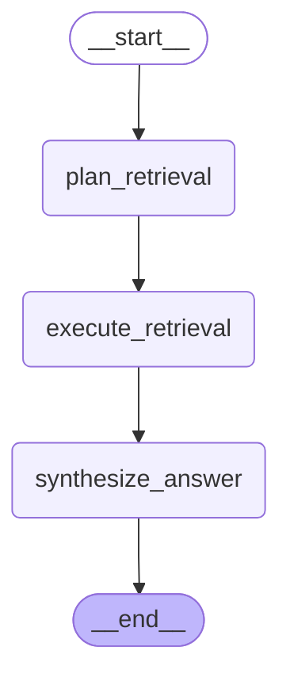

# Context Answerer Agent

The context answerer retrieves stored context and synthesizes evidence-backed
answers for agents and users.

The graph below is generated from the compiled LangGraph runtime.

## Inputs

- user or agent question
- allowed project ids
- retrieval budget from config
- context-store records and search indexes

## Flow

1. `plan_retrieval` chooses the context reads needed for the question.
2. `execute_retrieval` runs the bounded deterministic store reads.
3. `synthesize_answer` writes the final answer from retrieved evidence.

## Output

The answer includes cited context when evidence exists. When the store cannot
support a claim, the answer should say that instead of inventing context.
