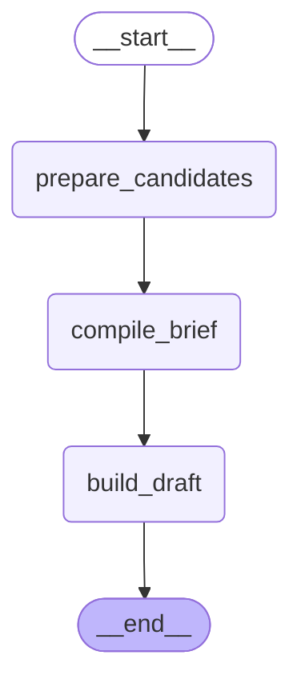

# Context Brief Agent

The context brief agent compiles startup context from stored records so a new
agent session can begin with compact project memory.

The graph below is generated from the compiled LangGraph runtime.

## Inputs

- recent and important context records for one project
- freshness metadata
- existing brief state

## Flow

1. `prepare_candidates` shapes context records for the compiler.
2. `compile_brief` selects and organizes startup context.
3. `build_draft` writes the generated markdown artifact.

## Output

The generated `CONTEXT_BRIEF.md` is a derived startup artifact. It is not the
durable context store.
