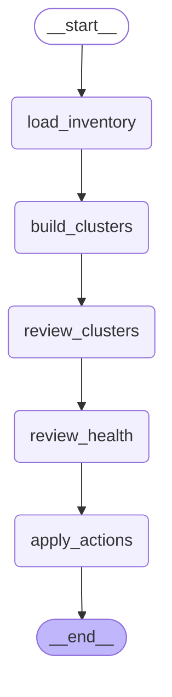

# Context Curator Agent

The context curator is the cold path. It keeps existing records compact,
non-duplicative, and current.

The graph below is generated from the compiled LangGraph runtime.

## Inputs

- active records for one project
- semantic-neighbor candidates
- curation budget from config

## Flow

1. `load_inventory` loads active records.
2. `build_clusters` groups likely-neighbor records.
3. `review_clusters` decides whether records duplicate, replace, or complement
   each other.
4. `review_health` reviews remaining records for routine episodes, stale
   context, or verbose recap style.
5. `apply_actions` applies validated archive, revise, and supersede actions.

## Output

The context store is updated in place. The curator prefers fewer stronger
records over many overlapping or routine records.
