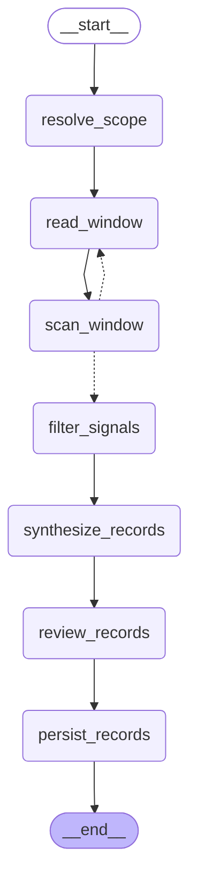

# Trace Ingestion Agent

Trace ingestion is the hot path. It turns one indexed source session into a
small episode record plus zero or more durable context records.

The graph below is generated from the compiled LangGraph runtime.

## Inputs

- indexed session metadata
- canonical trace JSONL path
- project or custom scope identity
- recent record manifest for duplicate awareness

## Flow

1. `resolve_scope` prepares the context-store target.
2. `read_window` reads a deterministic trace window.
3. `scan_window` observes candidate findings and loops until the trace is read.
4. `filter_signals` keeps only reusable signal.
5. `synthesize_records` drafts episode and durable records.
6. `review_records` checks whether records are useful and well-shaped.
7. `persist_records` writes validated records and provenance.

## Output

The output is written to the context store with evidence back to the source
session. A clean run can create no durable records when the trace has no
reusable context.
