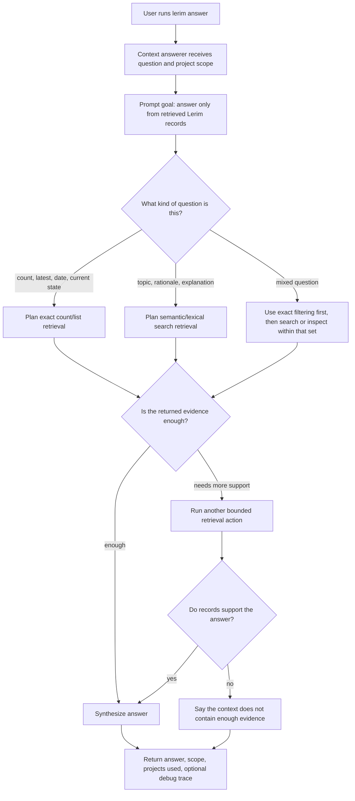

# lerim answer

Query existing project context.

## Examples

```bash
lerim answer "What decisions do we have about auth?"
lerim answer "How is caching handled?" --scope project --project lerim-cli
```

## How it works

`answer` uses the context answerer: BAML plans retrieval, Python executes read-only context-store queries, and BAML answers from the retrieved records.



Use `--scope project` when you want one project only.
