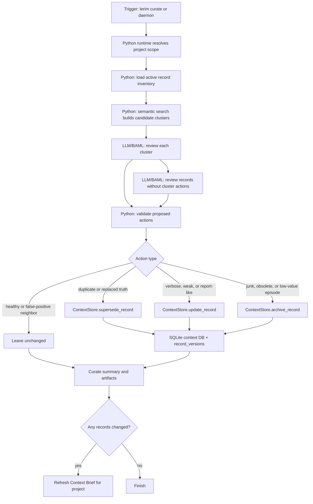

# lerim curate

Run one context-curation pass.

## Examples

```bash
lerim curate
lerim curate --dry-run
```

## What it does

`curate` reads existing records and keeps active context compact:

- supersede weaker duplicates with stronger records
- archive low-value records
- revise useful but verbose records
- leave healthy records unchanged

It works on the database.

## Flow


