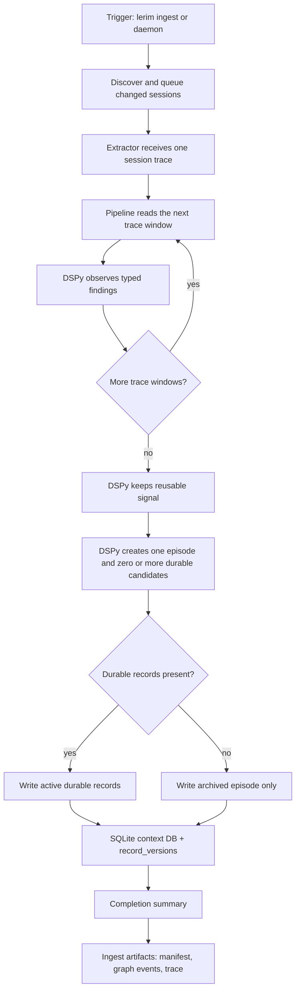

# lerim ingest

Discover supported trace sessions and extract context records.

## Examples

```bash
lerim ingest
lerim ingest --window 30d
lerim ingest --run-id <run_id> --force
lerim ingest --agent claude,codex
```

## What it does

- scans connected trace sources
- matches sessions to registered projects
- queues work
- runs selective trace-to-context extraction
- writes records into `~/.lerim/context.sqlite3`

When `--run-id` is provided, Lerim targets that single session. If the session
is not already in the local session catalog, Lerim asks the selected connected
adapter for that run id first. This is the path future completion hooks should
call after an agent run finishes.

## Flow



## Notes

- `--no-extract` only indexes and queues work
- `--dry-run` previews the operation
- `--run-id` honors `--agent`; for example, `--agent codex --run-id ...`
  will not process an indexed Claude session with the same id
