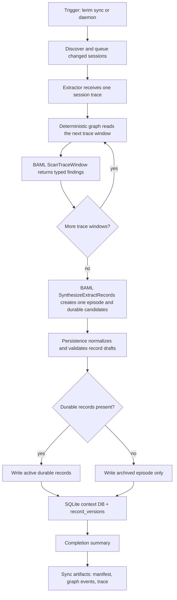

# lerim sync

Discover new sessions and extract context records.

## Examples

```bash
lerim sync
lerim sync --window 30d
lerim sync --run-id <run_id> --force
lerim sync --agent claude,codex
```

## What it does

- scans connected agent traces
- matches sessions to registered projects
- queues work
- runs extraction
- writes records into `~/.lerim/context.sqlite3`

## Flow



## Notes

- `--no-extract` only indexes and queues work
- `--dry-run` previews the operation
