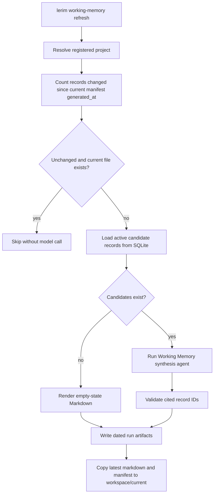

# lerim working-memory

`lerim working-memory` reads or refreshes generated startup context for the
resolved project.

It is host-only for `show`, `status`, and `path`. `refresh` runs local
generation and records a service run. The generated Markdown is a derived view
of `~/.lerim/context.sqlite3`.

## Commands

```bash
lerim working-memory show
lerim working-memory status
lerim working-memory path
lerim working-memory refresh
lerim working-memory refresh --force
```

| Subcommand | Description |
|------------|-------------|
| `show` | Print the current `WORKING_MEMORY.md` without model calls |
| `status` | Print availability, generated time, age, included records, changed-record count, paths, latest run folder, and suggested action |
| `path` | Print the stable expected current artifact path |
| `refresh` | Generate dated artifacts and update the stable current copy when records changed |

| Flag | Description |
|------|-------------|
| `--project` | Registered project name or path. Defaults to the project resolved from cwd |
| `--force` | On `refresh`, regenerate even when no context records changed |
| `--json` | Emit structured JSON for `status`, `path`, and `refresh` |

## Project Resolution

Agents should not hardcode project IDs. Lerim resolves the project from the
current directory by matching registered project paths. If the command is run
outside the repository, pass a registered project name or path:

```bash
lerim working-memory show --project lerim-cli
lerim working-memory status --project ~/codes/my-app
```

## Output Location

Current artifact:

```text
~/.lerim/workspace/current/<project_id>/WORKING_MEMORY.md
```

Dated run artifacts:

```text
~/.lerim/workspace/YYYY/MM/DD/working-memory/working-memory-<timestamp>-<id>/
```

## Generation Flow



## Automation

Working Memory is refreshed outside the sync hot path:

- the daemon runs a daily pass for all registered projects
- `maintain` runs it only for projects whose records changed
- unchanged projects are skipped
- manual `refresh --force` bypasses the unchanged check

See [Working Memory](../concepts/working-memory.md) for the architecture.
