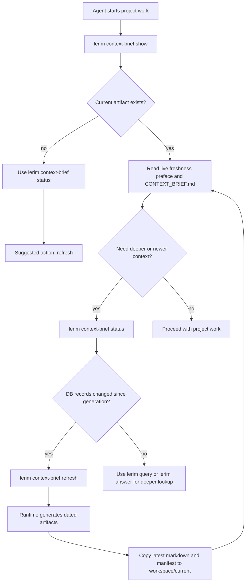
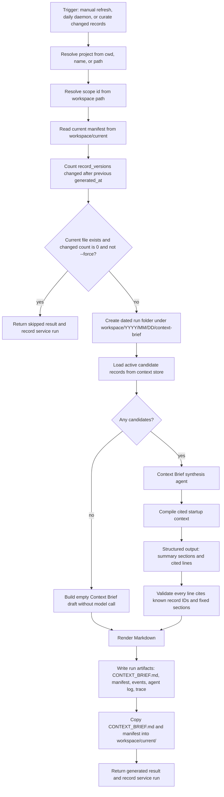

# Context Brief

Context Brief is Lerim's fast startup context for workflow-scoped agent work.

It is a generated Markdown view of durable context records. It is not a second
memory store, and agents should not edit it by hand. The source of truth remains
the durable context store.

In the current CLI, workflow scope is resolved through project registration.
For customer pilots, the same idea can map to clients, engagements, research
topics, teams, incidents, accounts, or other business scopes.

`lerim context-brief show` prepends live DB freshness before printing the
current markdown snapshot. The preface is current at read time; the markdown is
the last generated artifact.

The current view lives at:

```text
~/.lerim/workspace/current/<project_id>/CONTEXT_BRIEF.md
```

Agents do not need to know the internal scope id ahead of time. They should run
`lerim context-brief show`, `status`, or `path` from inside the current
workspace, or pass `--project <name-or-path>`.

## Flow



## Generation Architecture



## Agent Boundary

The Context Brief feature has two layers:

- `lerim.context_brief` owns deterministic use-case logic: project resolution,
  changed-record detection, candidate loading, validation, rendering, manifests,
  status, artifact paths, deterministic `Start Here`, fixed section order, and
  live freshness prefaces.
- `lerim.agents.context_brief` owns model synthesis only. It receives bounded
  candidate records and returns structured cited lines for the model-filled
  sections.

`LerimRuntime.context_brief()` ties those layers together. The daemon calls the
runtime for all registered projects during the daily pass, and after `curate`
only when curate changed records.

## Refresh Rules

Context Brief refresh is intentionally not part of the ingest hot path.

- `lerim context-brief show`, `status`, and `path` are fast local reads.
- `show` prepends live DB freshness before printing the static markdown snapshot.
- `lerim context-brief refresh` generates only when records changed, unless
  `--force` is passed.
- The daemon runs a daily pass across registered projects and skips unchanged
  projects.
- `curate` triggers Context Brief only when it creates, updates, archives,
  or otherwise changed records.
- Empty projects get an empty-state Markdown file without a model call.

## Fixed Markdown Shape

Generated Context Brief has a stable section order so agents can scan it
predictably:

1. `Summary`
2. `Start Here`
3. `Current Handoff`
4. `Decisions`
5. `Constraints & Preferences`
6. `Project Facts`
7. `Open Risks / Review Queue`
8. `Follow-up Queries`
9. `Sources`

`Summary` is the compact startup cache. `Start Here` is deterministic and
rendered by Lerim from project metadata and artifact status. `Current Handoff`
must come only from recent episode evidence; without that evidence, it should
explicitly say no persisted implementation handoff is available and point agents
back to the current chat, workspace state, and relevant checks for live work.

`Decisions`, `Constraints & Preferences`, and `Project Facts` hold durable
records. `Open Risks / Review Queue` and `Follow-up Queries` are populated only
from records that explicitly describe unresolved work, review concerns, or
questions worth asking next. `Sources` lists the cited record IDs used in the
body. Any test/build result in these sections is historical persisted evidence;
agents must rerun relevant checks after making edits.

## Artifact Layout

Each generation writes a dated run folder:

```text
~/.lerim/workspace/YYYY/MM/DD/context-brief/context-brief-<timestamp>-<id>/
  CONTEXT_BRIEF.md
  manifest.json
  events.jsonl
  agent.log
  agent-trace.json
```

The latest successful run is copied to the stable current path:

```text
~/.lerim/workspace/current/<project_id>/
  CONTEXT_BRIEF.md
  manifest.json
```

The manifest records the project, `project_id`, run folder, generated time,
previous generation time, trigger, candidate count, included record IDs, and
changed-record count before generation.

## What Agents Should Do

At startup, an agent working in a workspace should:

1. Run `lerim context-brief show` from the workspace.
2. If the file is missing or the task depends on newest context, run
   `lerim context-brief status`.
3. If status reports changed DB records, suggest or run
   `lerim context-brief refresh`.
4. Use `lerim query` for exact inspection and `lerim answer` for synthesized
   answers across more context.
