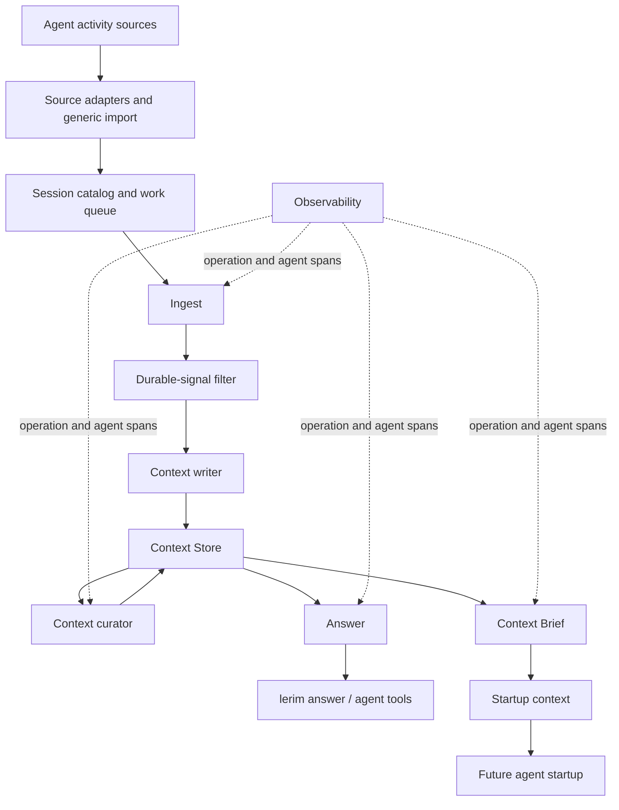
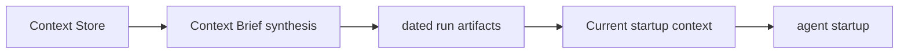

# How It Works

Lerim is trace-to-context infrastructure for repeated agent work.

## Summary

The flow is:

1. adapters read raw agent traces from supported sources
2. traces are normalized
3. the trace ingestor extracts durable context records and drops low-value candidates
4. the context curator cleans, merges, archives, and supersedes records
5. the context-brief compiler generates fast startup context from records
6. the context answerer retrieves records and answers questions

The current package includes supported source adapters. Customer deployments can
adapt the input layer around business traces such as research briefs, support
handoffs, incident investigations, revenue workflows, and custom internal agent
logs.

For operational targets and scale boundaries, see
[Capacity and SLOs](capacity-and-slos.md).

## Overall Architecture



## Implementation notes

The sections below describe the current open-source runtime. Product and pilot
conversations should usually start with the workflow boundary, source traces,
review rules, and reusable context outputs.

### Storage

Canonical storage is global:

- `~/.lerim/context.sqlite3` — projects, sessions, records, versions, embeddings, and FTS
- `~/.lerim/index/sessions.sqlite3` — session catalog and queue
- `~/.lerim/workspace/` — run artifacts and logs
- `~/.lerim/cache/traces/` — compacted agent trace cache
- `~/.lerim/models/embeddings/` — local ONNX embedding model cache
- `~/.lerim/models/huggingface/` — Hugging Face library cache

Projects are currently scoped by `project_id` inside the database.

### Agent runtime surface

Lerim does not expose raw SQL or file CRUD to agents.

The ingest flow reads deterministic trace windows, scans each window into typed
findings, filters for durable signal, synthesizes records once, and persists
them through the context store.

The expected product shape is:

```text
raw trace -> evidence -> durable signal -> scoped context -> future agent
```

Most routine traces should not create permanent context. A successful run can
produce only an archived episode when there is no reusable signal.

Curation loads active records, builds semantic-neighbor clusters, reviews each
cluster, reviews records not already targeted by a cluster action for
single-record health issues, then applies validated archive, revise, and
supersede operations through the context store.

The context answerer follows a small retrieval plan:

- plan exact count/list/search retrieval actions
- execute read-only context queries
- write the final answer from retrieved records only

Retrieval blends semantic and lexical signals so agents get compact, relevant
context rather than raw transcripts.

Search indexes are derived, not canonical:

- `records` is the authoritative source for durable context.
- `records_fts` mirrors canonical record text for lexical retrieval.
- `record_embeddings` mirrors canonical record search text for semantic
  retrieval.
- Index health is measured with `record_count`, `fts_count`,
  `embedding_count`, and `missing_embedding_count`.
- A fresh index has matching record, FTS, and embedding counts with no missing
  embeddings for the project scope being queried.
- If counts diverge, `answer` can still run, but retrieval is operationally
  degraded until curation or write-time refresh rebuilds derived rows from
  canonical records.

## Context Brief

Context Brief is also derived, not canonical. It renders a compact
`CONTEXT_BRIEF.md` from active project records so an agent can start with fast
context and then query deeper only when needed.



See [Context Brief](context-brief.md) for the full generation flow.

## Why this design

The agent says what it wants to do.
Python owns the storage mechanics.

That keeps:

- tool use smaller
- prompts cleaner
- invariants enforced in code
- training trajectories easier for smaller models later
