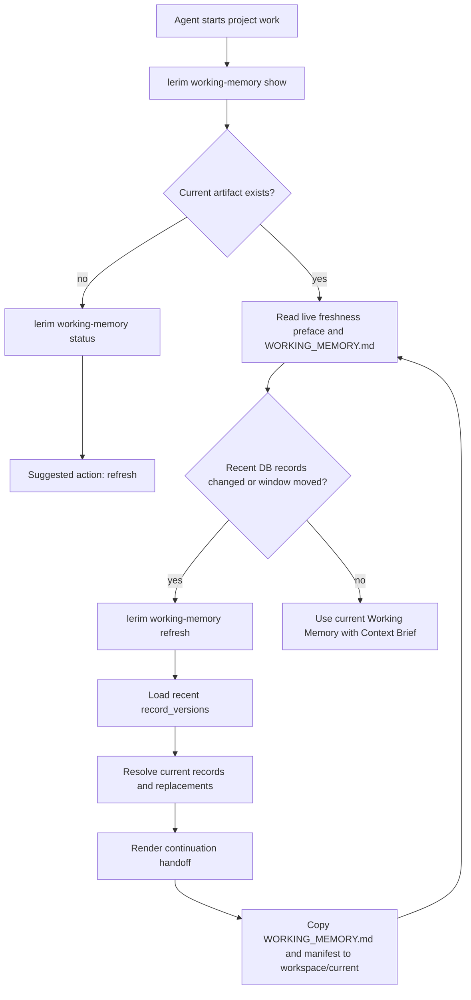

# Working Memory

Working Memory is Lerim's short-term continuation handoff. It is a generated
Markdown view of recent `record_versions`, not a second durable store.

Use it beside Context Brief:

- Context Brief: durable long-term decisions, preferences, constraints, and
  facts.
- Working Memory: what was recently completed or changed, which old records were
  superseded, and where to resume only if the next user prompt continues the
  same work.

Working Memory is not a task list. The next user prompt decides the next task.

The current view lives at:

```text
~/.lerim/workspace/current/<project_id>/WORKING_MEMORY.md
```

## Flow



## Generation

Working Memory is deterministic. It reads recent `record_versions` for the
resolved project, then fetches the current record for each changed record. When
a record was superseded, Working Memory follows `superseded_by_record_id` and
shows the replacement as the current final record.

The default recency window is six hours. A current Working Memory artifact
becomes stale when:

- the stable current file is missing
- the manifest is missing
- cited records disappeared from the live DB
- project records changed after the artifact was generated
- the six-hour short-term window has moved past the artifact age

## Sections

The Markdown artifact uses stable sections:

1. `Current State`
2. `Completed Recently`
3. `Changed Context`
4. `Current Final Decisions`
5. `Current Constraints & Preferences`
6. `Current Project Facts`
7. `Recent Episode Evidence`
8. `Recently Replaced / Archived`
9. `Open Questions`
10. `If Continuing This Work`
11. `Sources`

The important invariant is current truth. Superseded and archived records may
appear in `Changed Context` or `Recently Replaced / Archived`, but the current
sections use active records or their replacements. `If Continuing This Work`
must stay evidence-backed and must not invent generic next actions.

## Commands

```bash
lerim working-memory show
lerim working-memory status
lerim working-memory path
lerim working-memory refresh
lerim working-memory refresh --force
```

`show`, `status`, and `path` are fast local reads. `refresh` writes a dated run
folder under:

```text
~/.lerim/workspace/YYYY/MM/DD/working-memory/working-memory-<timestamp>-<id>/
```

The latest successful run is copied to:

```text
~/.lerim/workspace/current/<project_id>/
  WORKING_MEMORY.md
  WORKING_MEMORY.manifest.json
```
