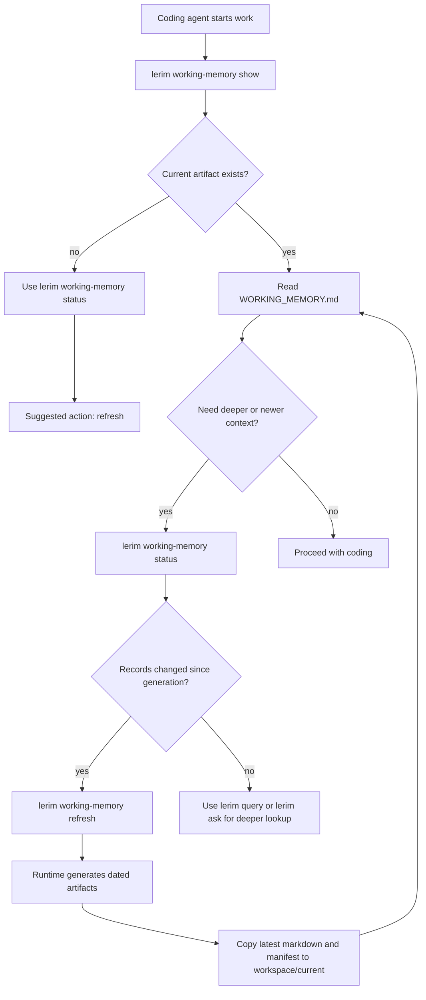
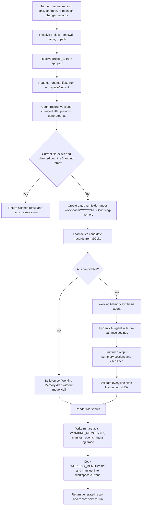

# Working Memory

Working Memory is Lerim's fast startup context for coding agents.

It is a generated Markdown view of durable SQLite context records. It is not a
second memory store, and agents should not edit it by hand. The source of truth
remains `~/.lerim/context.sqlite3`.

The current view lives at:

```text
~/.lerim/workspace/current/<project_id>/WORKING_MEMORY.md
```

Agents do not need to know `<project_id>` ahead of time. They should run
`lerim working-memory show`, `status`, or `path` from inside the repository, or
pass `--project <name-or-path>`.

## Flow



## Generation Architecture



## Agent Boundary

The Working Memory feature has two layers:

- `lerim.working_memory` owns deterministic use-case logic: project resolution,
  changed-record detection, candidate loading, validation, rendering, manifests,
  status, and artifact paths.
- `lerim.agents.working_memory` owns model synthesis only. It receives bounded
  candidate records and returns structured cited lines.

`LerimRuntime.working_memory()` ties those layers together. The daemon calls the
runtime for all registered projects during the daily pass, and after `maintain`
only when maintain changed records.

## Refresh Rules

Working Memory refresh is intentionally not part of the sync hot path.

- `lerim working-memory show`, `status`, and `path` are fast local reads.
- `lerim working-memory refresh` generates only when records changed, unless
  `--force` is passed.
- The daemon runs a daily pass across registered projects and skips unchanged
  projects.
- `maintain` triggers Working Memory only when it merged, archived,
  consolidated, or otherwise changed records.
- Empty projects get an empty-state Markdown file without a model call.

## Artifact Layout

Each generation writes a dated run folder:

```text
~/.lerim/workspace/YYYY/MM/DD/working-memory/working-memory-<timestamp>-<id>/
  WORKING_MEMORY.md
  manifest.json
  events.jsonl
  agent.log
  agent-trace.json
```

The latest successful run is copied to the stable current path:

```text
~/.lerim/workspace/current/<project_id>/
  WORKING_MEMORY.md
  manifest.json
```

The manifest records the project, `project_id`, run folder, generated time,
candidate count, included record IDs, and changed-record count.

## What Agents Should Do

At startup, a coding agent should:

1. Run `lerim working-memory show` from the repo.
2. If the file is missing or the task depends on newest context, run
   `lerim working-memory status`.
3. If status reports changed records, suggest or run
   `lerim working-memory refresh`.
4. Use `lerim query` for exact inspection and `lerim ask` for synthesized
   answers across more context.
