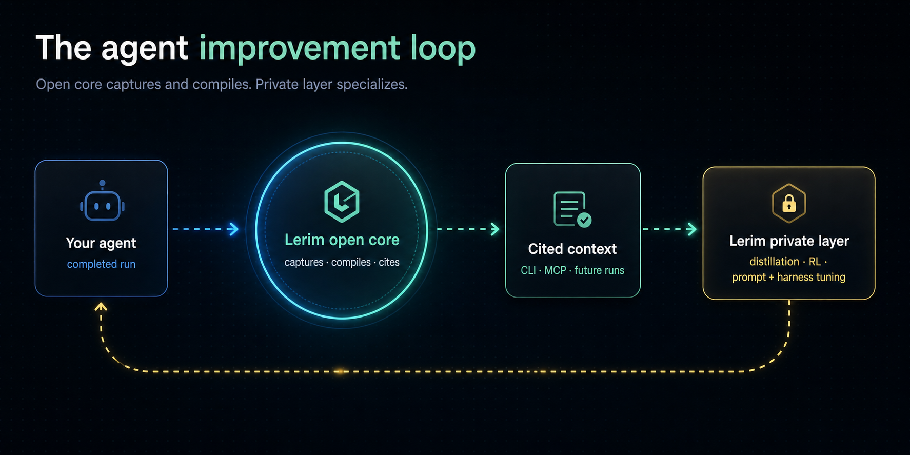

# Custom & Non-Coding Agents

Start here if your agent is **not** a coding agent with a native Lerim adapter.
That covers support, incident/security operations, research, compliance, revenue,
and any custom business agent that produces completed runs but does not live in an
IDE session store.

Coding agents (Claude Code, Codex CLI, Cursor, OpenCode, pi) have native adapters
that read completed sessions automatically. Everything else uses the **custom
agent path** below. Both paths feed the same compiler and the same context store.

<p align="center">
  
</p>

## 1. Does your agent have a native adapter?

If your agent runs as a coding agent in a local session store, use the native
adapter path instead — it is automatic:

```bash
lerim connect auto
lerim project add .
lerim up
```

See [Connecting Agents](connecting-agents.md) for the adapter list. If your agent
is API-driven, server-side, or part of a business workflow (support, incidents,
research, compliance, sales, internal tools), continue below.

## 2. Pick or write a signal profile

A signal profile tells Lerim's extraction what counts as durable signal for your
workflow and what is noise. Lerim bundles six profiles:

| Profile | Use for |
| --- | --- |
| `coding` | Repository and coding-agent work (default). |
| `support` | Customer support and customer operations. |
| `ops` | Incident response, operations, and reliability. |
| `research` | Research, market intelligence, and analysis. |
| `compliance` | Compliance, legal, regulatory, and policy review. |
| `generic` | General-purpose fallback when no other profile fits. |

List them and inspect one:

```bash
lerim profile list
lerim profile show research
```

If none fit — for example a sales, procurement, or internal business agent — write
your own YAML profile. It is four rule groups (`focus_rules`, `reject_as_noise`,
`evidence_rules`, `scope_rules`) and takes a few minutes. See
[Customize Lerim For Your Use Case](custom-source-profiles.md).

## 3. Get a clean completed-run trace

Lerim reads **completed** sessions, not live in-flight state. Export your agent's
finished run as canonical JSONL, one event per line:

```json
{"type":"user","message":{"role":"user","content":"..."},"timestamp":"2026-05-16T09:00:00Z"}
{"type":"assistant","message":{"role":"assistant","content":"..."},"timestamp":"2026-05-16T09:02:00Z"}
```

JSON arrays, wrapper objects (`messages` / `events` / `trace`), and plain text are
also accepted. See [Submit A Custom Agent Trace](submit-custom-agent-trace.md) for
the full shape reference.

**Clean before import.** Remove secrets, tokens, regulated personal data, and huge
raw payloads before the trace enters Lerim. Lerim extraction is selective, but it
is not a privacy firewall. For a quick first pass, use the
[defense-in-depth redaction helper](submit-custom-agent-trace.md#defense-in-depth-redaction).

## 4. Import it

One file:

```bash
lerim trace import ./my-agent-run.jsonl \
  --source-name support-agent \
  --source-profile support \
  --scope-type domain \
  --scope support-ops
```

Or register an ongoing folder of clean traces so background ingest picks up new
files automatically:

```bash
lerim project add ~/lerim-traces/support-clean --type custom --source-profile support
lerim ingest --agent custom
```

See [Custom Trace Folders](custom-trace-folders.md).

## 5. See the extracted context

```bash
lerim context records --source-profile support
lerim status
```

Routine sessions can produce zero durable records — that is the compiler rejecting
noise, not a failure. A useful run produces a few cited records across
`decision`, `constraint`, `fact`, `preference`, and `episode`.

## 6. Query it for the next run

```bash
lerim answer "What approval constraints should the next support agent know?"
lerim context-brief show
```

For MCP-capable agents, install Lerim as an MCP server so the agent can query
context in-loop: [MCP Quickstart](mcp-quickstart.md).

## 7. The improvement loop

Approved traces, corrections, and extracted records are structured, cited, and
scoped — which makes them reusable beyond the next query. They become
**training-ready data** for the same workflow (for example, distilling a strong
general model into a cheaper task-specific one).

Lerim has two layers. The **open core** (Apache-2.0, this repo) captures,
compiles, cites, and serves context. **Model specialization** — distillation, RL,
and prompt and harness tuning for a specific workflow — is the private Lerim
layer, built on top of this open foundation.

## Worked examples

Each of these shows a realistic trace, the real records Lerim extracted, and what
the next agent now knows:

- [Support Ops Demo](support-ops-demo.md)
- [Incident Ops Demo](incident-ops-demo.md)
- [Research Demo](research-demo.md)
- [Compliance Demo](compliance-demo.md)
