# Custom Trace Folders

Custom trace folders are for agents or business workflows that no upstream
trajectory adapter covers yet.

The boundary is intentionally simple:

- Supported agents are parsed by the [trajectory](https://github.com/letta-ai/trajectory)
  normalizer, which converts a harness transcript into trajectory-v1 records.
- Custom agents provide already-clean trajectory-v1 JSONL directly.
- Lerim scans the folder as one project with type `custom`.
- Lerim does not compact, rewrite, normalize, or clean custom traces.

Both paths end in the same record format, so a custom workflow gets the same
extraction pipeline as a coding agent.

<p align="center">
  
</p>

## User Journey

1. Export raw traces from your agent, ticket workflow, research workflow, or
   internal automation.
2. Write your own cleaner that converts those raw traces into trajectory-v1
   JSONL.
3. Put the cleaned `.jsonl` files in one folder.
4. Register that folder as a custom project with the right source profile.
5. Run Lerim ingest. Lerim indexes the clean files and extracts reusable
   context.

```bash
mkdir -p ~/lerim-traces/support-clean

lerim project add ~/lerim-traces/support-clean \
  --type custom \
  --source-profile support

lerim ingest --agent custom
```

Each `.jsonl` file is treated as one source session. Nested folders are fine:

```text
support-clean/
  renewals/
    run-2026-05-16-001.jsonl
  incidents/
    run-2026-05-16-002.jsonl
```

## Trajectory-v1 JSONL Schema

Lerim uses Letta's [trajectory](https://github.com/letta-ai/trajectory) standard
(`trajectory-v1`) as its single internal trace format. A trace file is an ordered
list of records, one compact JSON object per line, and the first record is always
`meta`.

The canonical schema ships with the pinned normalizer, under the active Lerim
data dir (default `~/.lerim`):
`~/.lerim/node/node_modules/@letta-ai/trajectory/schema/trajectory-v1.schema.json`.
Validate against that file, not against this page. Note that the schema describes
the whole trajectory as an array, so load every line of a file into a list and
validate the list.

```json
{"role":"meta","source":"support-agent"}
{"role":"user","content":"Customer asked for renewal approval.","timestamp":"2026-05-16T09:00:00Z"}
{"role":"reasoning","content":"Amount is above the auto-approval threshold, so check the billing record before answering.","timestamp":"2026-05-16T09:01:00Z"}
{"role":"assistant","content":null,"tool_calls":[{"id":"call_1","name":"billing_lookup","args":"{\"customer_id\":\"4421\"}"}],"timestamp":"2026-05-16T09:01:30Z"}
{"role":"tool","tool_call_id":"call_1","content":"plan status: inactive; last charge captured EUR 640.","timestamp":"2026-05-16T09:01:45Z"}
{"role":"assistant","content":"Approval is required above EUR 500, so this goes to the billing manager.","timestamp":"2026-05-16T09:02:00Z"}
```

| Role | Required keys | Optional keys |
|---|---|---|
| `meta` | `role`, `source` | `cwd`, `git_branch`, `model` |
| `user` | `role`, `content`, `timestamp` | -- |
| `reasoning` | `role`, `content`, `timestamp` | -- |
| `assistant` | `role`, `content`, `timestamp` | `tool_calls` |
| `tool` | `role`, `tool_call_id`, `content`, `timestamp` | -- |

Rules:

- One JSON object per line, compact. No pretty-printing, no blank padding lines,
  no trailing commas. Lerim cites evidence by line number, so one record per line
  is load-bearing.
- Record 0 is the only `meta` record. `source` is your agent or workflow name and
  must be non-empty.
- Every non-`meta` record needs an ISO-8601 `timestamp`
  (`2026-05-16T09:00:00Z` or `2026-05-16T11:00:00+02:00`). `null` is not accepted.
- `assistant.content` is `null` exactly when `tool_calls` is present. Otherwise it
  is a non-empty string. An assistant record never carries both.
- Each `tool_calls` entry needs `id`, `name`, and `args`, where **`args` is a JSON
  object serialized to a string**, not a nested object.
- Each `tool` record needs a non-empty `tool_call_id` matching an earlier
  `tool_calls` entry, plus its `content`.
- No extra keys anywhere. The schema rejects unknown properties.
- `content` is always a plain string. Structured content blocks are not accepted.
- One file equals one agent/workflow session.

Invalid files are skipped and logged. Lerim does not try to repair custom
traces because cleaning belongs to the source owner.

### Migrating From The Pre-Trajectory Shape

Lerim previously accepted an in-house shape,
`{"type","message":{"role","content"},"timestamp"}`. That shape is no longer read.
Cleaner scripts written against it must be regenerated — the mapping is
mechanical:

| Old | New |
|---|---|
| (no equivalent) | a leading `{"role":"meta","source":"<agent-name>"}` record |
| `type` / `message.role` | `role` |
| `message.content` (string) | `content` |
| `message.content` (block list) | flatten to one string, or split into several records |
| `timestamp: null` | a real ISO-8601 timestamp — `null` is now rejected |

Working examples in the new format live in `docs/examples/traces/` — see the
[support run](../examples/traces/support-agent-run.jsonl), which shows a tool
call and its linked result.

## Paste This Prompt Into Your Coding Agent

Use this prompt with Codex, Claude Code, or another coding agent in the folder
that contains your raw trace samples.

```text
You are helping me create a trace cleaner for Lerim.

Goal:
Convert raw agent or workflow traces into trajectory-v1 JSONL files.

Format authority:
trajectory-v1 is Letta's open trace standard (https://github.com/letta-ai/trajectory).
The canonical JSON Schema is on disk at
~/.lerim/node/node_modules/@letta-ai/trajectory/schema/trajectory-v1.schema.json
Read that file first and treat it as the contract. If anything below disagrees
with the schema, the schema wins.

Important boundary:
Lerim custom mode expects already-clean traces. Lerim will not compact, rewrite,
normalize, redact, or repair these files. The cleaning script we write here is
the source-specific adapter and privacy boundary.

Input:
- Inspect the raw trace files in this folder.
- Identify what represents one completed agent/workflow run.
- Write one output .jsonl file per run.

Output schema:
One compact JSON object per line. Record 0 is always the meta record. Every
other record carries an ISO-8601 timestamp.

{"role":"meta","source":"<agent-or-workflow-name>"}
  optional: "cwd", "git_branch", "model"

{"role":"user","content":"<string>","timestamp":"<ISO-8601>"}
{"role":"reasoning","content":"<string>","timestamp":"<ISO-8601>"}
{"role":"assistant","content":"<non-empty string>","timestamp":"<ISO-8601>"}
{"role":"assistant","content":null,
 "tool_calls":[{"id":"<string>","name":"<string>","args":"<stringified JSON object>"}],
 "timestamp":"<ISO-8601>"}
{"role":"tool","tool_call_id":"<matching id>","content":"<string>","timestamp":"<ISO-8601>"}

Hard constraints:
- assistant.content is null if and only if tool_calls is present.
- tool_call.args is a JSON object serialized to a string, never a nested object.
- every tool record's tool_call_id must match an earlier tool_calls entry id.
- no keys beyond the ones listed; the schema rejects unknown properties.
- content is always a plain string, never a list of content blocks.
- exactly one record per line, no pretty-printing — Lerim cites evidence by line
  number.

Mapping guidance:
- Use "user" for the human, customer, requester, system trigger, ticket text,
  workflow request, or external input.
- Use "assistant" for the agent, automation, analyst, support bot, or generated
  response.
- Use "reasoning" for the agent's private deliberation when the source records
  it: rejected options, stated constraints, why an approach was abandoned. This
  is high-value context; do not discard it.
- Use "assistant" + tool_calls / "tool" for real tool, API, query, or lookup
  steps and their results. Do not invent tool calls the source does not contain.
- Preserve useful chronology.
- Preserve decisions, constraints, evidence, assumptions, approvals, open
  questions, handoffs, tool results, source links, ticket ids, account ids,
  incident ids, and workflow ids when they are useful for future context.
- Drop binary blobs, screenshots, huge raw payloads, duplicate logs, progress
  noise, stack traces that add no future context, and vendor metadata that does
  not help future agents.
- Truncate very long tool results rather than dropping them; keep the head and
  the tail so the outcome survives.
- Redact secrets, access tokens, private keys, passwords, session cookies,
  regulated personal data, and any fields our retention policy forbids.
- Do not invent missing facts. If the source has no timestamp for a record,
  derive one from surrounding records rather than fabricating a plausible time.
- Do not use keyword matching as the main cleaning strategy. Parse the source
  structure and map its fields deliberately.

Script requirements:
- Create a Python script named clean_to_trajectory_jsonl.py.
- The script should accept:
  --input <raw-trace-folder-or-file>
  --output <clean-output-folder>
- It should create the output folder if needed.
- It should validate every output file against trajectory-v1.schema.json
  (load all lines of a file into a list and validate that list, since the schema
  describes the whole trajectory as an array).
- It should fail loudly on unknown source shapes instead of silently producing
  bad traces.
- It should print a summary with files read, sessions written, rows written,
  skipped items, and redaction count if redaction is implemented.

After writing the script:
1. Run it on the sample traces.
2. Show me the generated output tree.
3. Show me two short sample output lines.
4. Show me the schema-validation output for one generated file.
5. Explain any source fields you dropped and why.
```

After the cleaner runs, register the clean output folder:

```bash
python clean_to_trajectory_jsonl.py \
  --input ./raw-traces \
  --output ~/lerim-traces/support-clean

lerim project add ~/lerim-traces/support-clean \
  --type custom \
  --source-profile support
lerim ingest --agent custom
```

If your workflow needs its own focus/noise/evidence rules, register a custom
profile first, then use its id with `--source-profile`. See
[Customize Lerim For Your Use Case](custom-source-profiles.md).

## How This Differs From Supported Agents

Supported sources such as Claude Code and Codex CLI are discovered by Lerim and
handed to the trajectory normalizer, which knows each harness's transcript
format and emits trajectory-v1 records into Lerim's cache. Lerim then redacts
secrets and indexes the result.

Custom mode skips discovery and normalization. It reads your cleaned `.jsonl`
files directly from the registered folder and indexes them as
`agent_type=custom`. The project-level source profile controls extraction for
those sessions.

If your agent is one of the harnesses trajectory already supports upstream,
prefer the native path over a custom folder. If it is not, a custom folder is
the supported answer — and contributing an adapter upstream benefits every
trajectory consumer, not just Lerim.

## Operational Checks

```bash
lerim project list
lerim ingest --agent custom --no-extract
lerim queue --status pending
lerim status --live
```

Use `--no-extract` when you want to verify that the folder is discovered before
running model-backed extraction.
