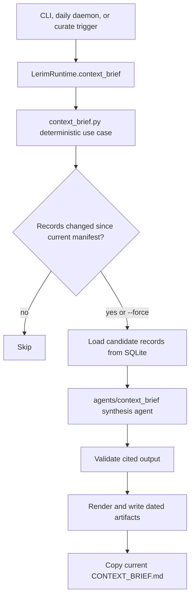

# Lerim Python Package

## Summary

This folder contains the Lerim runtime package.
Current architecture uses BAML plus LangGraph for trace ingestion, context
curation, context answering, and context-brief compilation.
Durable Lerim context now lives in the global SQLite store at `~/.lerim/context.sqlite3`.
Project identity is used to separate records by repo inside that shared DB.

The package is organized by feature boundary:

- `agents/`: agent flows (`trace_ingestion/`, `context_curator/`, `context_answerer/`, `context_brief/`), BAML source/client files (`baml_src/`, `baml_client/`), and typed contracts (`contracts.py`)
- `server/`: CLI (`cli.py`), HTTP API (`httpd.py`), daemon (`daemon.py`), runtime orchestrator (`runtime.py`), Docker/runtime API helpers (`api.py`)
- `config/`: config loading (`settings.py`), provider capability helpers (`providers.py`), tracing and logging setup
- `context/`: global SQLite context store, ONNX embedding provider, `sqlite-vec` index management, and retrieval/write helpers
- `sessions/`: session catalog and queue state (`catalog.py`)
- `adapters/`: session readers for Claude, Codex, Cursor, OpenCode
- `cloud/`: hosted auth/shipper integration (`auth.py`, `shipper.py`)
- `skills/`: bundled skill markdown files
- `context_brief.py`: deterministic Context Brief use-case logic, artifact paths, status, rendering, and validation

## How to use

If you are new to the codebase, read in this order:

1. `server/cli.py` for the public command surface.
2. `server/daemon.py` for ingest/curate scheduling and lock flow.
3. `server/runtime.py` for runtime orchestration across trace ingestion, context curation, context answering, and context briefs.
4. `context_brief.py` and `agents/context_brief/` for generated Context Brief.
5. `context/store.py` for the canonical SQLite schema and retrieval/write logic.
   This is where hybrid search happens: local ONNX embeddings, `sqlite-vec` KNN, SQLite FTS5, and RRF fusion.
6. `agents/trace_ingestion/` and `agents/context_curator/` for the write-side BAML/LangGraph flows.
7. `agents/context_answerer/` for the read-only BAML/LangGraph answer flow.
8. `agents/context_brief/` for BAML/LangGraph context-brief compilation.

## Context Brief flow

