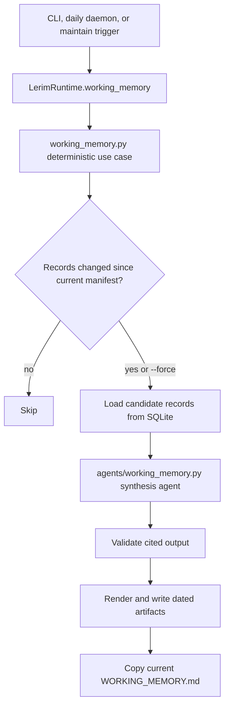

# Lerim Python Package

## Summary

This folder contains the Lerim runtime package.
Current architecture uses BAML plus LangGraph for sync extraction, and
PydanticAI for maintain, ask, and working-memory agent execution.
Durable Lerim context now lives in the global SQLite store at `~/.lerim/context.sqlite3`.
Project identity is used to separate records by repo inside that shared DB.

The package is organized by feature boundary:

- `agents/`: agent flows (`extract/`, `maintain.py`, `ask.py`, `working_memory.py`), BAML source/client files (`baml_src/`, `baml_client/`), semantic context tools (`tools.py`), typed contracts (`contracts.py`)
- `server/`: CLI (`cli.py`), HTTP API (`httpd.py`), daemon (`daemon.py`), runtime orchestrator (`runtime.py`), Docker/runtime API helpers (`api.py`)
- `config/`: config loading (`settings.py`), PydanticAI model builders (`providers.py`), tracing and logging setup
- `context/`: global SQLite context store, ONNX embedding provider, `sqlite-vec` index management, and retrieval/write helpers
- `sessions/`: session catalog and queue state (`catalog.py`)
- `adapters/`: session readers for Claude, Codex, Cursor, OpenCode
- `cloud/`: hosted auth/shipper integration (`auth.py`, `shipper.py`)
- `skills/`: bundled skill markdown files
- `working_memory.py`: deterministic Working Memory use-case logic, artifact paths, status, rendering, and validation

## How to use

If you are new to the codebase, read in this order:

1. `server/cli.py` for the public command surface.
2. `server/daemon.py` for sync/maintain scheduling and lock flow.
3. `server/runtime.py` for runtime orchestration across extract/maintain/ask.
4. `working_memory.py` and `agents/working_memory.py` for generated Working Memory.
5. `context/store.py` for the canonical SQLite schema and retrieval/write logic.
   This is where hybrid search happens: local ONNX embeddings, `sqlite-vec` KNN, SQLite FTS5, and RRF fusion.
6. `agents/extract/` and `agents/baml_src/` for sync extraction behavior.
7. `agents/tools.py` for the maintain/ask semantic tool surface (`list_context`, `search_context`, `get_context`, `revise_context`, `archive_context`, `supersede_context`, `count_context`).
8. `agents/maintain.py`, `agents/ask.py`, and `agents/working_memory.py` for PydanticAI agent behavior.

## Working Memory flow

