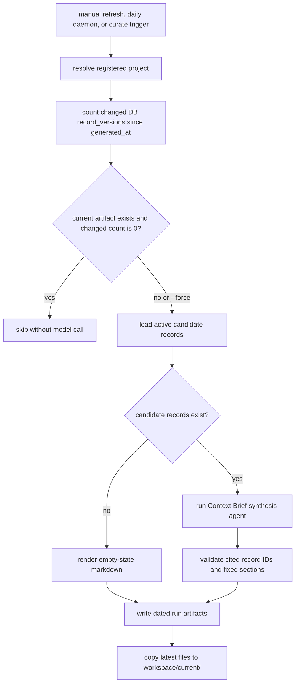

# Lerim CLI Reference (Source Of Truth)

Canonical parser source:
- `src/lerim/server/cli.py`

Canonical command:
- `lerim`

If `lerim` is not on `PATH`, resolve the runnable command in `SKILL.md` first.
Common fallback: `uvx lerim` or `$HOME/.local/bin/uvx lerim`.

Durable Lerim context lives in the global SQLite DB under the active Lerim data dir (default: `~/.lerim/context.sqlite3`).
Commands that call the HTTP API (`answer`, `ingest`, `curate`, `status`) require a
running server (`lerim up` or `lerim serve`). `unscoped` also requires the running
API. Most other commands are **host-only**
(local files, Docker CLI, local SQLite state). `mcp` is also host-only; MCP
clients launch it over stdio.
`context-brief show`, `context-brief status`, `context-brief path`,
`working-memory show`, `working-memory status`, and `working-memory path` are
fast local reads. `context-brief refresh` and `working-memory refresh` run local
generation for the resolved project and record service runs.

## Global flags

```bash
--json       # Emit structured JSON instead of human-readable text
--version    # Show version and exit
```

## Exit codes

- `0`: success
- `1`: runtime failure
- `2`: usage error
- `3`: partial success
- `4`: lock busy

## Command map

- `init` (host-only)
- `project` (`add`, `list`, `remove`) (host-only)
- `up` / `down` / `logs` (host-only)
- `serve` (Docker entrypoint, or run directly)
- `connect`
- `mcp` (host-only stdio MCP server)
- `ingest`
- `curate`
- context graph linking runs as part of `curate`
- `trace` (`import`) (host-only)
- `context-brief` (`show`, `status`, `path`, `refresh`) (host-only)
- `working-memory` (`show`, `status`, `path`, `refresh`) (host-only)
- `dashboard`
- `answer`
- `query`
- `context` (`records`)
- `profile` (`list`, `show`, `validate`, `register`) (host-only)
- `status`
- `queue`
- `unscoped`
- `retry`
- `skip`
- `memory` (`reset`) (host-only)
- `skill` (`install`) (host-only)
- `auth` (`login`, `status`, `logout`, or bare `lerim auth`)

## Commands

### `lerim init` (host-only)

Interactive setup wizard. Detects installed agent sources and writes config to
the active Lerim config path (default: `~/.lerim/config.toml`).

```bash
lerim init
```

### `lerim project` (host-only)

Manage tracked project paths. Project registration only records the path and
source type. There is no project-local Lerim state directory. Durable Lerim
context stays in `~/.lerim/context.sqlite3`.

```bash
lerim project add ~/codes/my-app       # register a project
lerim project add .                     # register current directory
lerim project add ~/traces --type custom --source-profile support # clean custom traces
lerim project list                      # show all registered projects
lerim project remove my-app             # unregister a project
```

| Flag | Default | Description |
|------|---------|-------------|
| `--type` | `supported` | `supported` for projects whose sessions come from connected adapters; `custom` for folders of already-clean Lerim canonical JSONL traces |

Adding/removing a project restarts the Docker container if running.

### `lerim up` / `lerim down` (host-only)

Docker container lifecycle.

```bash
lerim up                    # start Lerim (pull GHCR image)
lerim up --build            # build/recreate from the local Dockerfile
lerim down                  # stop it
```

| Flag | Default | Description |
|------|---------|-------------|
| `--build` | off | Build from local Dockerfile, tag it as `lerim-lerim:local`, and recreate the container instead of pulling the GHCR image |

### `lerim logs` (host-only)

View local log entries from dated JSONL files under `~/.lerim/logs/YYYY/MM/DD/`.

```bash
lerim logs                      # show recent logs
lerim logs --follow             # tail logs continuously
lerim logs --level error        # filter by level
lerim logs --since 2h           # entries from the last 2 hours
lerim logs --json               # raw JSONL output
```

| Flag | Default | Description |
|------|---------|-------------|
| `--follow`, `-f` | off | Live tail: watch for new log lines |
| `--level` | -- | Filter by log level (case-insensitive): error, warning, info |
| `--since` | -- | Show entries from the last N hours/minutes/days (e.g. `1h`, `30m`, `2d`) |
| `--json` | off | Output raw JSONL lines instead of formatted text |

### `lerim memory reset` (host-only)

Delete learned context while keeping setup files, project registration, and agent connections.

```bash
lerim memory reset --project my-repo --yes
lerim memory reset --all --yes
```

| Flag | Default | Description |
|------|---------|-------------|
| `--project` | -- | Reset one registered project by name or path |
| `--all` | off | Reset learned context for every registered project |
| `--yes` | off | Confirm the reset without an interactive prompt |

### `lerim serve`

JSON HTTP API + daemon loop in one process (Docker entrypoint). This repo does
not bundle the full web UI; GET `/` may return a small stub page pointing to
Lerim Cloud when no static assets are present.

```bash
lerim serve
lerim serve --host 0.0.0.0 --port 8765  # custom bind
```

### `lerim connect`

Register, list, or remove native trace adapters and MCP client config.
Lerim reads session data from connected native platforms to build context
records. MCP clients can query Lerim and submit completed sessions through the
stdio server.

Native adapter targets: `claude`, `codex`, `cursor`, `opencode`, `pi`.

MCP config targets: `codex`, `claude-code`, `cursor`, `opencode`, `gemini-cli`,
`cline`, `cline-cli`, `claude-desktop`, `openclaw`, `hermes`, `goose`,
`roo-code`, `kilo-code`, `windsurf`, `openhuman`.

```bash
lerim connect list                        # show connected native platforms
lerim connect list --all                  # include MCP target status
lerim connect                             # same as list
lerim connect auto                        # auto-detect and connect native adapters
lerim connect claude                      # connect the Claude platform
lerim connect pi                          # connect pi's native JSONL sessions
lerim connect claude --path /custom/dir   # connect with custom session store path
lerim connect auto --mode mcp --dry-run   # preview MCP config writes
lerim connect auto --mode mcp             # write Lerim MCP config for detected targets
lerim connect gemini-cli --mode mcp       # write one MCP target
lerim connect codex --mode auto           # try native adapter and MCP setup
lerim connect auto --mode auto --dry-run  # preview native and detected MCP setup
lerim connect openclaw --mode plugin      # pending plugin status, no MCP fallback
lerim connect doctor codex                # inspect one MCP target config
lerim connect remove claude               # disconnect Claude
```

| Flag | Description |
|------|-------------|
| `platform_name` | Optional action/platform: `list`, `auto`, `doctor`, `remove`, a native platform name, or an MCP target name. Omit to list connections |
| `extra_arg` | Used with `remove` -- the platform to disconnect |
| `--path` | Custom filesystem path to the platform's session store |
| `--mode` | `adapter` for native trace registration, `mcp` for MCP client config, `auto` for both available paths, or `plugin` for planned plugin status |
| `--dry-run` | Preview config changes without writing; in `--mode auto`, also preview native adapter registration |
| `--force` | Rewrite an existing Lerim MCP entry |
| `--all` | Include MCP targets in `connect list` |

`--mode auto` reports native adapter and MCP results separately. Target-specific
auto mode tries the native adapter when one exists and writes MCP config when the
target is known. `lerim connect auto --mode auto` writes MCP config only for
detected installed MCP targets. `--mode plugin` is intentionally pending for
OpenClaw, Hermes, and pi; it returns nonzero and does not silently run MCP setup.

### `lerim mcp` (host-only)

Start Lerim's stdio MCP server. Agent clients normally launch this command from
their MCP config.

```bash
lerim mcp
```

Exposed tools:

- `lerim_context_brief`
- `lerim_context_answer`
- `lerim_context_search`
- `lerim_records_list`
- `lerim_trace_submit`
- `lerim_ingest_status`

### `lerim ingest`

Hot-path: discover new sessions from connected platforms and custom clean-trace
folders, enqueue them, and run extraction to create context records.
Requires a running server (`lerim up` or `lerim serve`).

**Time window** controls which sessions to scan:
- `--window <duration>` -- relative window like `7d`, `24h`, `30m` (default: from config, `7d`)
- `--window all` -- scan all sessions ever recorded
- `--since` / `--until` -- absolute ISO-8601 bounds (overrides `--window`)

Duration format: `<number><unit>` where unit is `s` (seconds), `m` (minutes), `h` (hours), `d` (days).

```bash
lerim ingest                          # ingest using configured window (default: 7d)
lerim ingest --window 30d             # ingest last 30 days
lerim ingest --window all             # ingest everything
lerim ingest --agent claude,codex     # only ingest these platforms
lerim ingest --agent custom           # only ingest custom trace folders
lerim ingest --run-id abc123 --force  # re-extract a specific session
lerim ingest --since 2026-02-01T00:00:00Z --until 2026-02-08T00:00:00Z
lerim ingest --no-extract             # index and enqueue only, skip extraction
lerim ingest --dry-run                # preview what would happen, no writes
lerim ingest --max-sessions 100       # process up to 100 sessions
```

| Flag | Default | Description |
|------|---------|-------------|
| `--run-id` | -- | Target a single session by run ID; if it is not indexed yet, discover it through the selected connected adapter before queuing extraction |
| `--agent` | all | Comma-separated platform filter (e.g. `claude,codex`) |
| `--window` | config `ingest_window_days` (`7d`) | Relative time window (`30s`, `2m`, `1h`, `7d`, or `all`) |
| `--since` | -- | ISO-8601 start bound (overrides `--window`) |
| `--until` | now | ISO-8601 end bound (only with `--since`) |
| `--max-sessions` | config `ingest_max_sessions` (`50`) | Max sessions to extract per run |
| `--no-extract` | off | Index/enqueue only, skip extraction |
| `--force` | off | Re-extract already-processed sessions |
| `--dry-run` | off | Preview mode, no writes |

Notes:
- `ingest` is the hot path (queue + DSPy extraction + context write).
- Normal backlog ingest claims the newest available session per project first.
- `--ignore-lock` exists only as a CLI-local debug flag and is intentionally not supported by `/api/ingest`; skipping the writer lock risks corruption.
- Cold curation work is not executed in `ingest`.

### `lerim trace import` (host-only)

Import one JSON, JSONL, or text trace file into an explicit scope.

For ongoing custom-agent workflows, prefer custom project folders:

```bash
lerim project add ~/lerim-traces/support-clean \
  --type custom \
  --source-profile support
lerim ingest --agent custom
```

Use `trace import` only when you intentionally want a one-file import into a
non-project scope.

```bash
lerim trace import ./support-agent-run.jsonl \
  --source-name support-bot \
  --source-profile support \
  --scope-type domain \
  --scope support
```

| Flag | Description |
|------|-------------|
| `path` | Trace file path. JSON, JSONL, and plain text are accepted |
| `--source-name` | Source agent or system name, for example `support-bot` |
| `--source-profile` | Source profile, for example `coding`, `generic`, `support`, `ops`, or a registered custom profile |
| `--scope-type` | One of `project`, `domain`, `user`, `session`, `workspace`, or `custom` |
| `--scope` | Scope token. For `project`, pass the repository path |
| `--scope-label` | Optional human-readable scope label |
| `--session-id` | Optional stable session id. Defaults to the normalized trace id |
| `--force` | Re-run extraction even when the same session id already has identical normalized trace content |

The imported trace is copied to the Lerim workspace imports directory in compact
canonical form, then ingested into the shared context store. If the same
session id already points at identical normalized trace content, Lerim skips the
duplicate unless `--force` is set.

For sensitive or very noisy traces, run a customer-owned cleaner before import.
Lerim filters for durable signal during ingestion, but it is not the only
redaction, privacy, or compliance boundary for arbitrary custom traces.

### `lerim trace submissions`

List MCP-submitted trace manifests. This is the recovery surface for failed
`lerim_trace_submit` calls.

```bash
lerim trace submissions
lerim trace submissions --status failed --limit 10
```

| Flag | Description |
|------|-------------|
| `--status` | Filter by status such as `failed`, `imported`, `duplicate_skipped`, or `all` |
| `--limit` | Maximum submitted traces to show |

### `lerim trace retry`

Retry an MCP-submitted trace using the saved sidecar metadata.

```bash
lerim trace retry ~/.lerim/workspace/mcp-submissions/2026/05/19/example.json
lerim trace retry ~/.lerim/workspace/mcp-submissions/2026/05/19/example.json --force
```

`trace retry` uses the saved source name, source profile, scope, label, and
session id from the `.lerim-submission.json` manifest. It reruns Lerim's normal
generic importer and DSPy extraction; it does not bypass extraction or
save arbitrary memories.

### `lerim curate`

Cold-path: offline context refinement. Scans existing records and merges
duplicates, archives low-value items, and consolidates related context.
Requires a running server (`lerim up` or `lerim serve`).

```bash
lerim curate                # run one curation pass
lerim curate --dry-run      # preview only, no writes
```

| Flag | Description |
|------|-------------|
| `--dry-run` | Record a run but skip actual record changes |

### `lerim context-brief` (host-only)

Generated long-term markdown startup context for project-scoped agent work. The markdown lives under
`~/.lerim/workspace/current/<project_id>/CONTEXT_BRIEF.md` and is a derived
view of `~/.lerim/context.sqlite3`, not a second memory store.

```bash
lerim context-brief show              # print live DB freshness + markdown
lerim context-brief status            # show freshness metadata
lerim context-brief path              # print stable current file path
lerim context-brief refresh           # regenerate if records changed
lerim context-brief refresh --force   # regenerate even if unchanged
```

| Subcommand | Description |
|------------|-------------|
| `show` | Print live DB freshness plus the current `CONTEXT_BRIEF.md` without model calls |
| `status` | Print availability, generated time, age, records included, DB changed-record count, current path, latest run, and suggested action |
| `path` | Print the stable expected current artifact path |
| `refresh` | Generate dated artifacts and update the stable current copy |

| Flag | Description |
|------|-------------|
| `--project` | Registered project name or path. Defaults to the project resolved from cwd |
| `--force` | On `refresh`, regenerate even when no context records changed |
| `--json` | Emit structured JSON for `status`, `path`, and `refresh` |

Rendered artifact shape:

| Section | Source |
|---------|--------|
| `Summary` | Compact cited startup cache |
| `Start Here` | Deterministic Lerim guidance for project scope, freshness, workspace state, and verification |
| `Continuation Handoff` | Recent episode evidence only; otherwise an explicit no-handoff note |
| `Decisions` | Durable decision records |
| `Constraints & Preferences` | Durable constraint and preference records |
| `Project Facts` | Durable facts that prevent mistakes |
| `Open Risks / Review Queue` | Records that explicitly identify unresolved work, risks, or review concerns |
| `Follow-up Queries` | Records that explicitly justify deeper lookup questions |
| `Sources` | Cited record IDs used by the body |

Notes:
- Agents should call `lerim context-brief show` instead of hardcoding a `project_id`.
- Use `lerim context-brief status` for dynamic freshness: current age, DB record-change count, current path, latest run folder, and suggested action.
- Treat validation/build/check results inside Context Brief as historical persisted evidence; rerun relevant checks after edits.
- `show` prepends live DB freshness; the markdown that follows is still the last generated snapshot.
- `Start Here` is deterministic. Do not read it as model-written evidence.
- `Continuation Handoff` is valid only when backed by recent episode records.
- Use `lerim working-memory show` for short-term continuation context.
- Daily daemon refresh and curate-triggered refresh skip unchanged projects.
- Ingest does not directly trigger Context Brief in v1.

Flow:



### `lerim working-memory` (host-only)

Generated short-term markdown handoff for recent continuation context. The markdown
lives under `~/.lerim/workspace/current/<project_id>/WORKING_MEMORY.md` and is a
derived view of recent `record_versions`, not a second memory store.

```bash
lerim working-memory show              # print live freshness + markdown
lerim working-memory status            # show short-window freshness metadata
lerim working-memory path              # print stable current file path
lerim working-memory refresh           # regenerate if records changed or window moved
lerim working-memory refresh --force   # regenerate even if fresh
```

| Subcommand | Description |
|------------|-------------|
| `show` | Print live freshness plus the current `WORKING_MEMORY.md` |
| `status` | Print availability, generated time, age, window, changed-record count, current path, latest run, and suggested action |
| `path` | Print the stable expected current artifact path |
| `refresh` | Generate dated artifacts and update the stable current copy |

Notes:
- Working Memory uses a six-hour recency window.
- It follows `superseded_by_record_id` to show current replacements for recently superseded records.
- Superseded and archived records are history; actionable sections use current active records.
- `If Continuing This Work` is not a task list; the next user prompt decides the next task.
- Daily daemon refresh and curate-triggered refresh skip fresh projects.

### Background ingest and curate

There is **no** separate `lerim daemon` command. The daemon loop (ingest + curate
on `ingest_interval_minutes` / `curate_interval_minutes`, plus daily Context Brief
and Working Memory)
runs **inside**
`lerim serve` and therefore inside `lerim up` (Docker).

### `lerim dashboard`

Start the local dashboard UI. If the backend API is not reachable, the command
starts it with the Docker runtime path used by `lerim up`.

```bash
lerim up                    # optional explicit backend startup
lerim up --build            # optional local backend rebuild
lerim dashboard
lerim dashboard --port 3001
```

| Flag | Default | Description |
|------|---------|-------------|
| `--port` | `3000` | Local dashboard UI port |

### `lerim answer`

One-shot query: answer Lerim a question with context-informed retrieval.
Requires a running server (`lerim up` or `lerim serve`).

```bash
lerim answer 'What auth pattern do we use?'
lerim answer "How is the database configured?"
lerim answer "How is the database configured?" --verbose
```

| Flag | Default | Description |
|------|---------|-------------|
| `question` | required | Your question (quote if spaces) |
| `--scope` | `all` | Read scope: `all` or `project` |
| `--project` | -- | Project name/path when `--scope=project` |
| `--verbose` | off | Show the full sanitized answer trace in message order |

Notes:
- Answer uses hybrid retrieval for explanatory questions: local ONNX embeddings, `sqlite-vec`, SQLite FTS5, and RRF.
- Answer uses deterministic query tools for count/latest/date questions.
- `--verbose` prints the ordered answer trace: prompts, tool calls, tool returns, and assistant text.
- System prompts are shown as character counts, not full text.
- Tool-return payloads are clipped to the first 200 characters to keep the trace readable.
- Hidden provider reasoning is not exposed.
- If provider auth fails, CLI returns exit code 1.

### `lerim query`

Deterministic count/list queries over records, versions, or sessions.

```bash
lerim query records count
lerim query records list --kind decision --limit 10
lerim query records list --created-since 2026-04-17T00:00:00+00:00
lerim query sessions list --order-by created_at --limit 20
```

| Flag | Default | Description |
|------|---------|-------------|
| `entity` | required | `records`, `versions`, or `sessions` |
| `mode` | required | `list` or `count` |
| `--scope` | `all` | Read scope: `all` or `project` |
| `--project` | -- | Project name/path when `--scope=project` |
| `--kind` | -- | Filter record/versions by kind |
| `--source-profile` | -- | Filter record/versions by source profile |
| `--status` | -- | Filter record/versions by status |
| `--source-session-id` | -- | Filter by source session |
| `--created-since` | -- | Lower bound for `created_at` |
| `--created-until` | -- | Upper bound for `created_at` |
| `--updated-since` | -- | Lower bound for `updated_at` |
| `--updated-until` | -- | Upper bound for `updated_at` |
| `--valid-at` | -- | Point-in-time validity filter |
| `--order-by` | `created_at` | Records/versions: `created_at`, `updated_at`, or `valid_from`; sessions: `created_at` only, newest first |
| `--limit` | `20` | Page size for `list` |
| `--offset` | `0` | Page offset for `list` |
| `--include-total` | `false` | Include total matching rows for `list` |

### `lerim profile`

Inspect bundled source profiles, register custom YAML profiles, and review
records by profile.

Use this when you want to customize what Lerim remembers for a vertical or
understand which records are being attributed to a profile.

```bash
lerim profile list
lerim profile show support
lerim profile show support --kind decision
lerim profile show support --kind fact --limit 30
lerim profile validate ./research.yaml
lerim profile register ./research.yaml
```

| Subcommand | Description |
|------------|-------------|
| `list` | Show bundled and registered source profiles with record counts |
| `show` | Show profile record mix and recent records |
| `validate` | Validate a custom source-profile YAML file without changing config |
| `register` | Add a custom source-profile YAML file to `[profiles]` in config |

| Flag | Description |
|------|-------------|
| `name` | Source profile to inspect, for example `support`, `ops`, `generic`, or `coding` |
| `path` | YAML file path for `validate` or `register` |
| `--kind` | Filter records by kind (`decision`, `fact`, `episode`, `constraint`, `preference`) |
| `--limit` | Max records to inspect (default: `20`) |
| `--force` | Replace an existing custom profile registration for the same id |

### `lerim context records`

List context records using profile/kind filters.

```bash
lerim context records
lerim context records --profile support --type fact --limit 50
lerim context records --profile support --type constraint --status active --json
lerim context records --source-profile support --type fact --project my-repo --limit 25
```

| Flag | Description |
|------|-------------|
| `--profile` | Filter by source profile, for example `support`, `ops`, `generic`, or `coding` |
| `--source-profile` | Backward-compatible alias for `--profile` |
| `--type` | Filter by durable record kind (`fact`, `constraint`, `episode`, `preference`, etc.) |
| `--status` | Filter by storage record status, for example `active` or `archived` |
| `--scope` | `all` (default) or `project` |
| `--project` | Project name/path when `--scope=project` |
| `--source-session-id` | Filter records created from one source session |
| `--limit` | Max records to show |
| `--offset` | Page offset |
| `--json` | Emit machine-readable JSON |

### `lerim status`

Print runtime state: connected platforms, context record count, session queue stats,
and timestamps of the latest ingest/curate runs.
Requires a running server (`lerim up` or `lerim serve`).

```bash
lerim status
lerim status --scope project --project lerim-cli
lerim status --live
lerim status --live --interval 1
lerim status --json    # structured JSON output
```

| Flag | Default | Description |
|------|---------|-------------|
| `--scope` | `all` | Status scope: all projects or one project |
| `--project` | -- | Project name/path when `--scope=project` |
| `--live` | off | Refresh the status display until interrupted |
| `--interval` | `3.0` | Refresh interval in seconds for `--live` |

### `lerim queue`

Host-only: reads the session extraction queue from the local SQLite catalog (no HTTP).

```bash
lerim queue
lerim queue --failed
lerim queue --status pending
lerim queue --project lerim-cli
lerim queue --json
```

| Flag | Description |
|------|-------------|
| `--failed` | Only failed + dead_letter jobs |
| `--status` | Filter by status (`pending`, `running`, `failed`, `dead_letter`, `done`) |
| `--project` | Exact project name/path match |

### `lerim unscoped`

List indexed sessions that do not match any registered project.
Requires a running server (`lerim up` or `lerim serve`).

```bash
lerim unscoped
lerim unscoped --limit 100
```

### `lerim retry`

Host-only: reset `dead_letter` jobs to `pending` so the daemon can re-process them.

```bash
lerim retry a1b2c3d4
lerim retry --project lerim-cli
lerim retry --all
```

### `lerim skip`

Host-only: mark `dead_letter` jobs as done (skipped) to unblock the queue.

```bash
lerim skip a1b2c3d4
lerim skip --project lerim-cli
lerim skip --all
```

### `lerim auth`

Authenticate with the hosted auth service (browser login, token, status, logout).

```bash
lerim auth                    # browser OAuth (default)
lerim auth --token lerim_tok_...
lerim auth login
lerim auth status
lerim auth logout
```

### `lerim skill` (host-only)

Install Lerim skill files into supported agent directories.

Installs to two locations:
- `~/.agents/skills/lerim/` — shared by Cursor, Codex, OpenCode, and others
- `~/.claude/skills/lerim/` — Claude Code (reads only from its own directory)

```bash
lerim skill install
```
