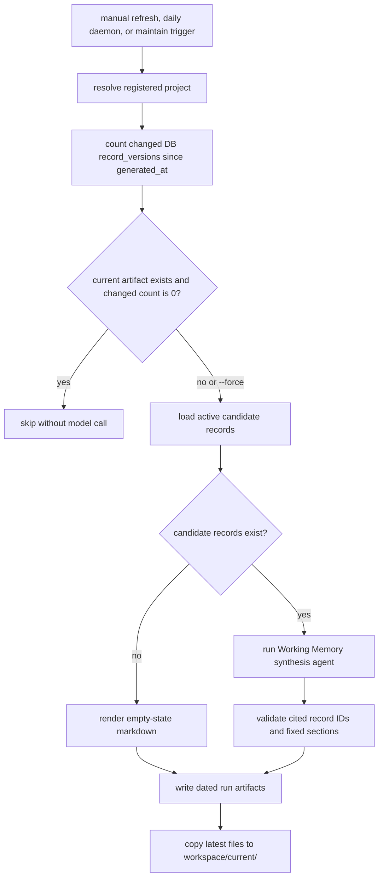

# Lerim CLI Reference (Source Of Truth)

Canonical parser source:
- `src/lerim/server/cli.py`

Canonical command:
- `lerim`

If `lerim` is not on `PATH`, resolve the runnable command in `SKILL.md` first.
Common fallback: `uvx lerim` or `/Users/kargarisaac/.local/bin/uvx lerim`.

Durable Lerim context lives in the global SQLite DB under the active Lerim data dir (default: `~/.lerim/context.sqlite3`).
Commands that call the HTTP API (`ask`, `sync`, `maintain`, `status`) require a
running server (`lerim up` or `lerim serve`). `unscoped` also requires the running
API. Most other commands are **host-only**
(local files, Docker CLI, local SQLite state).
`working-memory show`, `working-memory status`, and `working-memory path` are
fast local reads. `working-memory refresh` runs local generation for the resolved
project and records a service run.

## Global flags

```bash
--json       # Emit structured JSON instead of human-readable text
--version    # Show version and exit
```

## Exit codes

- `0`: success
- `1`: runtime failure
- `2`: usage error
- `3`: partial success
- `4`: lock busy

## Command map

- `init` (host-only)
- `project` (`add`, `list`, `remove`) (host-only)
- `up` / `down` / `logs` (host-only)
- `serve` (Docker entrypoint, or run directly)
- `connect`
- `sync`
- `maintain`
- `working-memory` (`show`, `status`, `path`, `refresh`) (host-only)
- `dashboard`
- `ask`
- `query`
- `status`
- `queue`
- `unscoped`
- `retry`
- `skip`
- `memory` (`reset`) (host-only)
- `skill` (`install`) (host-only)
- `auth` (`login`, `status`, `logout`, or bare `lerim auth`)

## Commands

### `lerim init` (host-only)

Interactive setup wizard. Detects installed coding agents and writes config to
the active Lerim config path (default: `~/.lerim/config.toml`).

```bash
lerim init
```

### `lerim project` (host-only)

Manage tracked repositories. Project registration only records the repository path.
There is no project-local Lerim state directory. Durable Lerim context stays in
`~/.lerim/context.sqlite3`.

```bash
lerim project add ~/codes/my-app       # register a project
lerim project add .                     # register current directory
lerim project list                      # show all registered projects
lerim project remove my-app             # unregister a project
```

Adding/removing a project restarts the Docker container if running.

### `lerim up` / `lerim down` (host-only)

Docker container lifecycle.

```bash
lerim up                    # start Lerim (pull GHCR image)
lerim up --build            # build/recreate from the local Dockerfile
lerim down                  # stop it
```

| Flag | Default | Description |
|------|---------|-------------|
| `--build` | off | Build from local Dockerfile, tag it as `lerim-lerim:local`, and recreate the container instead of pulling the GHCR image |

### `lerim logs` (host-only)

View local log entries from dated JSONL files under `~/.lerim/logs/YYYY/MM/DD/`.

```bash
lerim logs                      # show recent logs
lerim logs --follow             # tail logs continuously
lerim logs --level error        # filter by level
lerim logs --since 2h           # entries from the last 2 hours
lerim logs --json               # raw JSONL output
```

| Flag | Default | Description |
|------|---------|-------------|
| `--follow`, `-f` | off | Live tail: watch for new log lines |
| `--level` | -- | Filter by log level (case-insensitive): error, warning, info |
| `--since` | -- | Show entries from the last N hours/minutes/days (e.g. `1h`, `30m`, `2d`) |
| `--json` | off | Output raw JSONL lines instead of formatted text |

### `lerim memory reset` (host-only)

Delete learned context while keeping setup files, project registration, and agent connections.

```bash
lerim memory reset --project my-repo --yes
lerim memory reset --all --yes
```

| Flag | Default | Description |
|------|---------|-------------|
| `--project` | -- | Reset one registered project by name or path |
| `--all` | off | Reset learned context for every registered project |
| `--yes` | off | Confirm the reset without an interactive prompt |

### `lerim serve`

JSON HTTP API + daemon loop in one process (Docker entrypoint). This repo does
not bundle the full web UI; GET `/` may return a small stub page pointing to
Lerim Cloud when no static assets are present.

```bash
lerim serve
lerim serve --host 0.0.0.0 --port 8765  # custom bind
```

### `lerim connect`

Register, list, or remove agent platform connections.
Lerim reads session data from connected platforms to build context records.

Supported platforms: `claude`, `codex`, `cursor`, `opencode`

```bash
lerim connect list                        # show all connected platforms
lerim connect                             # same as list
lerim connect auto                        # auto-detect and connect all known platforms
lerim connect claude                      # connect the Claude platform
lerim connect claude --path /custom/dir   # connect with custom session store path
lerim connect remove claude               # disconnect Claude
```

| Flag | Description |
|------|-------------|
| `platform_name` | Optional action/platform: `list`, `auto`, `remove`, or a platform name. Omit to list connections |
| `extra_arg` | Used with `remove` -- the platform to disconnect |
| `--path` | Custom filesystem path to the platform's session store |

### `lerim sync`

Hot-path: discover new agent sessions from connected platforms, enqueue them,
and run BAML plus LangGraph extraction to create context records.
Requires a running server (`lerim up` or `lerim serve`).

**Time window** controls which sessions to scan:
- `--window <duration>` -- relative window like `7d`, `24h`, `30m` (default: from config, `7d`)
- `--window all` -- scan all sessions ever recorded
- `--since` / `--until` -- absolute ISO-8601 bounds (overrides `--window`)

Duration format: `<number><unit>` where unit is `s` (seconds), `m` (minutes), `h` (hours), `d` (days).

```bash
lerim sync                          # sync using configured window (default: 7d)
lerim sync --window 30d             # sync last 30 days
lerim sync --window all             # sync everything
lerim sync --agent claude,codex     # only sync these platforms
lerim sync --run-id abc123 --force  # re-extract a specific session
lerim sync --since 2026-02-01T00:00:00Z --until 2026-02-08T00:00:00Z
lerim sync --no-extract             # index and enqueue only, skip extraction
lerim sync --dry-run                # preview what would happen, no writes
lerim sync --max-sessions 100       # process up to 100 sessions
```

| Flag | Default | Description |
|------|---------|-------------|
| `--run-id` | -- | Target a single session by run ID (bypasses index scan) |
| `--agent` | all | Comma-separated platform filter (e.g. `claude,codex`) |
| `--window` | config `sync_window_days` (`7d`) | Relative time window (`30s`, `2m`, `1h`, `7d`, or `all`) |
| `--since` | -- | ISO-8601 start bound (overrides `--window`) |
| `--until` | now | ISO-8601 end bound (only with `--since`) |
| `--max-sessions` | config `sync_max_sessions` (`50`) | Max sessions to extract per run |
| `--no-extract` | off | Index/enqueue only, skip extraction |
| `--force` | off | Re-extract already-processed sessions |
| `--dry-run` | off | Preview mode, no writes |

Notes:
- `sync` is the hot path (queue + BAML/LangGraph extraction + context write).
- Normal backlog sync claims the newest available session per project first.
- `--ignore-lock` exists only as a CLI-local debug flag and is intentionally not supported by `/api/sync`; skipping the writer lock risks corruption.
- Cold maintenance work is not executed in `sync`.

### `lerim maintain`

Cold-path: offline context refinement. Scans existing records and merges
duplicates, archives low-value items, and consolidates related context.
Requires a running server (`lerim up` or `lerim serve`).

```bash
lerim maintain                # run one maintenance pass
lerim maintain --dry-run      # preview only, no writes
```

| Flag | Description |
|------|-------------|
| `--dry-run` | Record a run but skip actual record changes |

### `lerim working-memory` (host-only)

Generated markdown startup context for coding agents. The markdown lives under
`~/.lerim/workspace/current/<project_id>/WORKING_MEMORY.md` and is a derived
view of `~/.lerim/context.sqlite3`, not a second memory store.

```bash
lerim working-memory show              # print live DB freshness + markdown
lerim working-memory status            # show freshness metadata
lerim working-memory path              # print stable current file path
lerim working-memory refresh           # regenerate if records changed
lerim working-memory refresh --force   # regenerate even if unchanged
```

| Subcommand | Description |
|------------|-------------|
| `show` | Print live DB freshness plus the current `WORKING_MEMORY.md` without model calls |
| `status` | Print availability, generated time, age, records included, DB changed-record count, current path, latest run, and suggested action |
| `path` | Print the stable expected current artifact path |
| `refresh` | Generate dated artifacts and update the stable current copy |

| Flag | Description |
|------|-------------|
| `--project` | Registered project name or path. Defaults to the project resolved from cwd |
| `--force` | On `refresh`, regenerate even when no context records changed |
| `--json` | Emit structured JSON for `status`, `path`, and `refresh` |

Rendered artifact shape:

| Section | Source |
|---------|--------|
| `Summary` | Compact cited startup cache |
| `Start Here` | Deterministic Lerim guidance for repo scope, freshness, git state, and verification |
| `Current Handoff` | Recent episode evidence only; otherwise an explicit no-handoff note |
| `Decisions` | Durable decision records |
| `Constraints & Preferences` | Durable constraint and preference records |
| `Project Facts` | Durable facts and references that prevent mistakes |
| `Open Risks / Review Queue` | Records that explicitly identify unresolved work, risks, or review concerns |
| `Follow-up Queries` | Records that explicitly justify deeper lookup questions |
| `Sources` | Cited record IDs used by the body |

Notes:
- Coding agents should call `lerim working-memory show` instead of hardcoding a `project_id`.
- Use `lerim working-memory status` for dynamic freshness: current age, DB record-change count, current path, latest run folder, and suggested action.
- Treat test/build results inside Working Memory as historical persisted evidence; rerun relevant checks after edits.
- `show` prepends live DB freshness; the markdown that follows is still the last generated snapshot.
- `Start Here` is deterministic. Do not read it as model-written evidence.
- `Current Handoff` is valid only when backed by recent episode records.
- Daily daemon refresh and maintain-triggered refresh skip unchanged projects.
- Sync does not directly trigger Working Memory in v1.

Flow:



### Background sync and maintain

There is **no** separate `lerim daemon` command. The daemon loop (sync + maintain
on `sync_interval_minutes` / `maintain_interval_minutes`, plus daily Working Memory)
runs **inside**
`lerim serve` and therefore inside `lerim up` (Docker).

### `lerim dashboard`

Shows current web UI status and lists CLI alternatives for common tasks.

```bash
lerim dashboard
```

### `lerim ask`

One-shot query: ask Lerim a question with context-informed retrieval.
Requires a running server (`lerim up` or `lerim serve`).

```bash
lerim ask 'What auth pattern do we use?'
lerim ask "How is the database configured?"
lerim ask "How is the database configured?" --verbose
```

| Flag | Default | Description |
|------|---------|-------------|
| `question` | required | Your question (quote if spaces) |
| `--scope` | `all` | Read scope: `all` or `project` |
| `--project` | -- | Project name/path when `--scope=project` |
| `--verbose` | off | Show the full sanitized ask trace in message order |

Notes:
- Ask uses hybrid retrieval for explanatory questions: local ONNX embeddings, `sqlite-vec`, SQLite FTS5, and RRF.
- Ask uses deterministic query tools for count/latest/date questions.
- `--verbose` prints the ordered ask trace: prompts, tool calls, tool returns, and assistant text.
- System prompts are shown as character counts, not full text.
- Tool-return payloads are clipped to the first 200 characters to keep the trace readable.
- Hidden provider reasoning is not exposed.
- If provider auth fails, CLI returns exit code 1.

### `lerim query`

Deterministic count/list queries over records, versions, or sessions.

```bash
lerim query records count
lerim query records list --kind decision --limit 10
lerim query records list --created-since 2026-04-17T00:00:00+00:00
lerim query sessions list --order-by created_at --limit 20
```

| Flag | Default | Description |
|------|---------|-------------|
| `entity` | required | `records`, `versions`, or `sessions` |
| `mode` | required | `list` or `count` |
| `--scope` | `all` | Read scope: `all` or `project` |
| `--project` | -- | Project name/path when `--scope=project` |
| `--kind` | -- | Filter record/versions by kind |
| `--status` | -- | Filter record/versions by status |
| `--source-session-id` | -- | Filter by source session |
| `--created-since` | -- | Lower bound for `created_at` |
| `--created-until` | -- | Upper bound for `created_at` |
| `--updated-since` | -- | Lower bound for `updated_at` |
| `--updated-until` | -- | Upper bound for `updated_at` |
| `--valid-at` | -- | Point-in-time validity filter |
| `--order-by` | `created_at` | Records/versions: `created_at`, `updated_at`, or `valid_from`; sessions: `created_at` only, newest first |
| `--limit` | `20` | Page size for `list` |
| `--offset` | `0` | Page offset for `list` |
| `--include-total` | `false` | Include total matching rows for `list` |

### `lerim status`

Print runtime state: connected platforms, context record count, session queue stats,
and timestamps of the latest sync/maintain runs.
Requires a running server (`lerim up` or `lerim serve`).

```bash
lerim status
lerim status --scope project --project lerim-cli
lerim status --live
lerim status --live --interval 1
lerim status --json    # structured JSON output
```

| Flag | Default | Description |
|------|---------|-------------|
| `--scope` | `all` | Status scope: all projects or one project |
| `--project` | -- | Project name/path when `--scope=project` |
| `--live` | off | Refresh the status display until interrupted |
| `--interval` | `3.0` | Refresh interval in seconds for `--live` |

### `lerim queue`

Host-only: reads the session extraction queue from the local SQLite catalog (no HTTP).

```bash
lerim queue
lerim queue --failed
lerim queue --status pending
lerim queue --project lerim-cli
lerim queue --json
```

| Flag | Description |
|------|-------------|
| `--failed` | Only failed + dead_letter jobs |
| `--status` | Filter by status (`pending`, `running`, `failed`, `dead_letter`, `done`) |
| `--project` | Exact project name/path match |

### `lerim unscoped`

List indexed sessions that do not match any registered project.
Requires a running server (`lerim up` or `lerim serve`).

```bash
lerim unscoped
lerim unscoped --limit 100
```

### `lerim retry`

Host-only: reset `dead_letter` jobs to `pending` so the daemon can re-process them.

```bash
lerim retry a1b2c3d4
lerim retry --project lerim-cli
lerim retry --all
```

### `lerim skip`

Host-only: mark `dead_letter` jobs as done (skipped) to unblock the queue.

```bash
lerim skip a1b2c3d4
lerim skip --project lerim-cli
lerim skip --all
```

### `lerim auth`

Authenticate with the hosted auth service (browser login, token, status, logout).

```bash
lerim auth                    # browser OAuth (default)
lerim auth --token lerim_tok_...
lerim auth login
lerim auth status
lerim auth logout
```

### `lerim skill` (host-only)

Install Lerim skill files into coding agent directories.

Installs to two locations:
- `~/.agents/skills/lerim/` — shared by Cursor, Codex, OpenCode, and others
- `~/.claude/skills/lerim/` — Claude Code (reads only from its own directory)

```bash
lerim skill install
```
